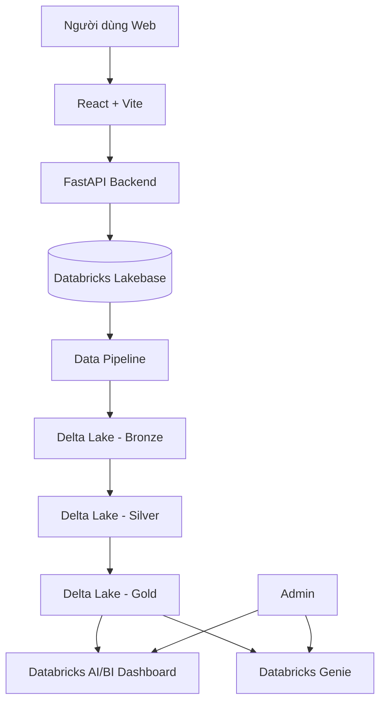

# PROPOSAL

## Tên đề tài

**Xây dựng nền tảng thương mại điện tử đa nhà bán hàng dành cho thời trang, tích hợp phân tích dữ liệu và trợ lý AI trên Databricks**

---

## 1. Thông tin nhóm

**Thành viên**
- Nguyễn Trường Sơn - 23010313
- Nguyễn Ngọc Minh - 23010623

**Giảng viên hướng dẫn**
- Nguyễn Văn Sơn

**Thời gian thực hiện**
- Ngày bắt đầu: 17/08/2026
- Deadline dự kiến: 12/10/2026

**Trạng thái hiện tại**
- Đang lên kế hoạch

---

## 2. Bối cảnh và lý do chọn đề tài

Thương mại điện tử ngày càng trở thành một kênh mua sắm phổ biến, đặc biệt trong lĩnh vực thời trang. Người dùng có nhu cầu tìm kiếm, so sánh và đặt mua sản phẩm trực tuyến nhanh chóng, trong khi các cửa hàng cần một hệ thống hỗ trợ quản lý sản phẩm, đơn hàng, tồn kho và doanh thu một cách hiệu quả.

Đề tài hướng tới xây dựng một nền tảng thương mại điện tử đa nhà bán hàng dành riêng cho lĩnh vực thời trang. Mô hình hệ thống được lấy cảm hứng từ các marketplace như Shopee, nhưng phạm vi được thu gọn để phù hợp với đồ án. Mỗi chủ shop có thể tự quản lý sản phẩm, nguồn hàng, kho và đơn hàng của mình; người mua có thể tìm kiếm, lựa chọn và đặt mua sản phẩm; admin chịu trách nhiệm quản lý toàn bộ nền tảng.

Bên cạnh các chức năng thương mại điện tử cơ bản, đề tài tập trung thêm vào kiến trúc dữ liệu trên Databricks. Dữ liệu vận hành được lưu trong Lakebase, trong khi dữ liệu phục vụ phân tích được xử lý và lưu trữ trên Delta Lake theo mô hình Medallion Architecture. Hệ thống cũng tích hợp Databricks AI/BI Dashboard và Databricks Genie nhằm hỗ trợ trực quan hóa dữ liệu và truy vấn bằng ngôn ngữ tự nhiên.

---

## 3. Mục tiêu đề tài

Mục tiêu chính của đề tài là xây dựng một hệ thống thương mại điện tử thời trang có thể hỗ trợ cả nghiệp vụ vận hành và phân tích dữ liệu.

Các mục tiêu cụ thể gồm:

- Xây dựng website thương mại điện tử đa nhà bán hàng.
- Hỗ trợ quản lý người mua, chủ shop và admin hệ thống.
- Hỗ trợ quản lý sản phẩm thời trang theo biến thể như size và màu sắc.
- Hỗ trợ giỏ hàng, đặt hàng, thanh toán và giao hàng mô phỏng.
- Hỗ trợ chủ shop quản lý nhà cung cấp, nhập hàng và tồn kho.
- Cảnh báo cho chủ shop khi sản phẩm có tồn kho thấp.
- Theo dõi doanh thu, số lượng đơn hàng, tỷ lệ hủy đơn và các chỉ số kinh doanh.
- Xây dựng luồng dữ liệu từ Lakebase sang Delta Lake.
- Tổ chức dữ liệu phân tích theo các tầng Bronze, Silver và Gold.
- Xây dựng dashboard phục vụ theo dõi hoạt động kinh doanh.
- Tích hợp Databricks Genie để admin có thể truy vấn dữ liệu bằng ngôn ngữ tự nhiên.

---

## 4. Phạm vi hệ thống

Hệ thống là một website thương mại điện tử dành cho các sản phẩm thời trang như quần áo, giày dép, túi xách và phụ kiện thời trang.

Hệ thống có ba nhóm người dùng chính:

### 4.1. Người mua hàng

Người mua có thể:

- Đăng ký và đăng nhập.
- Xem danh sách sản phẩm.
- Tìm kiếm và lọc sản phẩm.
- Xem thông tin chi tiết sản phẩm.
- Chọn biến thể theo size và màu sắc.
- Thêm sản phẩm vào giỏ hàng.
- Đặt hàng.
- Thanh toán mô phỏng.
- Theo dõi trạng thái đơn hàng.
- Xem lịch sử mua hàng.
- Đánh giá sản phẩm sau khi đơn hàng hoàn tất.

Để đơn giản hóa nghiệp vụ, một giỏ hàng chỉ chứa sản phẩm của một shop.

### 4.2. Chủ shop

Chủ shop có thể:

- Quản lý thông tin shop.
- Quản lý sản phẩm và danh mục sản phẩm.
- Quản lý biến thể sản phẩm.
- Quản lý giá bán.
- Quản lý đơn hàng của shop.
- Cập nhật trạng thái đơn hàng.
- Quản lý nhà cung cấp.
- Quản lý quá trình nhập hàng.
- Quản lý tồn kho.
- Nhận cảnh báo khi hàng tồn kho thấp.
- Theo dõi doanh thu và hiệu quả kinh doanh.

Mỗi shop quản lý một kho riêng trong phiên bản hiện tại.

### 4.3. Admin hệ thống

Admin có thể:

- Quản lý tài khoản người dùng.
- Quản lý các shop trên nền tảng.
- Theo dõi sản phẩm và đơn hàng toàn hệ thống.
- Theo dõi hoạt động của nền tảng.
- Xem dashboard tổng quan.
- Truy vấn dữ liệu toàn hệ thống thông qua Databricks Genie.

---

## 5. Các chức năng chính

### 5.1. Chức năng cơ bản

- Authentication và Authorization.
- Quản lý tài khoản.
- Quản lý shop.
- Quản lý sản phẩm.
- Quản lý category.
- Quản lý product variant.
- Quản lý size và color.
- Giỏ hàng.
- Checkout.
- Thanh toán mô phỏng.
- Quản lý đơn hàng.
- Theo dõi trạng thái giao hàng.
- Rating và Review.

### 5.2. Chức năng nâng cao

- Supplier Management.
- Purchase / Restock Management.
- Inventory Management.
- Low Stock Alert.
- Data Analytics.
- AI/BI Dashboard.
- Databricks Genie AI Assistant.

---

## 6. Luồng nghiệp vụ chính

### 6.1. Luồng mua hàng

1. Người mua đăng nhập vào hệ thống.
2. Người mua tìm kiếm hoặc lựa chọn sản phẩm.
3. Người mua chọn size, màu sắc và số lượng.
4. Sản phẩm được thêm vào giỏ hàng.
5. Hệ thống kiểm tra các sản phẩm trong giỏ thuộc cùng một shop.
6. Người mua thực hiện checkout.
7. Hệ thống tạo đơn hàng.
8. Thanh toán được mô phỏng.
9. Chủ shop tiếp nhận và xử lý đơn hàng.
10. Người mua theo dõi trạng thái đơn hàng.
11. Khi đơn được giao thành công, người mua có thể đánh giá sản phẩm.

### 6.2. Trạng thái đơn hàng

```text
PENDING
   ↓
CONFIRMED
   ↓
PREPARING
   ↓
SHIPPING
   ↓
DELIVERED
```

Đơn hàng có thể chuyển sang trạng thái:

```text
CANCELLED
```

### 6.3. Luồng quản lý nhập hàng và tồn kho

1. Chủ shop quản lý danh sách nhà cung cấp.
2. Chủ shop tạo thông tin nhập hàng.
3. Khi hàng được nhận, số lượng tồn kho được cập nhật.
4. Khi phát sinh đơn hàng thành công, tồn kho được trừ tương ứng.
5. Nếu tồn kho thấp hơn ngưỡng thiết lập, hệ thống tạo cảnh báo cho chủ shop.

---

## 7. Use Case chính

### UC01 - Đăng ký / Đăng nhập

**Actor:** Người mua, Chủ shop, Admin

**Mô tả:** Người dùng đăng nhập để sử dụng các chức năng phù hợp với vai trò.

**Luồng chính:**
1. Người dùng nhập thông tin đăng nhập.
2. Hệ thống xác thực.
3. Hệ thống xác định role.
4. Người dùng được chuyển tới giao diện phù hợp.

---

### UC02 - Tìm kiếm và xem sản phẩm

**Actor:** Người mua

**Mô tả:** Người mua tìm kiếm sản phẩm theo tên, danh mục hoặc bộ lọc.

**Luồng chính:**
1. Người mua nhập từ khóa hoặc chọn bộ lọc.
2. Hệ thống truy vấn sản phẩm phù hợp.
3. Danh sách kết quả được hiển thị.
4. Người mua chọn một sản phẩm để xem chi tiết.

---

### UC03 - Đặt hàng

**Actor:** Người mua

**Tiền điều kiện:** Người dùng đã đăng nhập và giỏ hàng có sản phẩm.

**Luồng chính:**
1. Người mua mở giỏ hàng.
2. Hệ thống kiểm tra tồn kho.
3. Người mua nhập địa chỉ giao hàng.
4. Người mua chọn phương thức thanh toán mô phỏng.
5. Hệ thống tạo đơn hàng.
6. Đơn hàng chuyển sang trạng thái `PENDING`.

**Ngoại lệ:**
- Nếu sản phẩm không đủ tồn kho, hệ thống không cho phép đặt hàng.
- Nếu giỏ hàng chứa sản phẩm thuộc shop khác, hệ thống yêu cầu xử lý trước khi checkout.

---

### UC04 - Quản lý đơn hàng

**Actor:** Chủ shop

**Luồng chính:**
1. Chủ shop xem danh sách đơn hàng.
2. Chủ shop mở chi tiết đơn.
3. Chủ shop xác nhận đơn.
4. Chủ shop chuẩn bị hàng.
5. Chủ shop cập nhật trạng thái giao hàng.
6. Hệ thống lưu lại lịch sử trạng thái.

---

### UC05 - Quản lý sản phẩm và tồn kho

**Actor:** Chủ shop

**Luồng chính:**
1. Chủ shop tạo hoặc chỉnh sửa sản phẩm.
2. Chủ shop cấu hình các biến thể size và màu sắc.
3. Chủ shop cập nhật giá.
4. Hệ thống theo dõi số lượng tồn kho theo biến thể.
5. Khi tồn kho thấp hơn ngưỡng, hệ thống tạo cảnh báo.

---

### UC06 - Truy vấn dữ liệu bằng Genie

**Actor:** Admin

**Tiền điều kiện:** Dữ liệu phân tích đã được xử lý và cấp quyền phù hợp.

**Luồng chính:**
1. Admin nhập câu hỏi bằng ngôn ngữ tự nhiên.
2. Databricks Genie diễn giải yêu cầu.
3. Genie truy vấn dữ liệu phân tích.
4. Hệ thống trả về kết quả cho admin.

**Ví dụ:**
- Doanh thu toàn hệ thống tháng này là bao nhiêu?
- Shop nào có doanh thu cao nhất?
- Có bao nhiêu đơn hàng đang giao?
- Sản phẩm nào bán chạy nhất?
- Những sản phẩm nào đang có tồn kho thấp?

Trong phiên bản mở rộng, Genie có thể được cung cấp cho chủ shop với điều kiện mỗi shop chỉ được truy vấn dữ liệu của chính shop đó.

---

## 8. Kiến trúc hệ thống



Hệ thống được chia thành hai phần chính:

- **Operational System:** phục vụ các nghiệp vụ giao dịch của website.
- **Analytical System:** phục vụ báo cáo, phân tích và AI.

---

## 9. Kiến trúc dữ liệu

### 9.1. Dữ liệu vận hành

Databricks Lakebase được sử dụng để lưu các dữ liệu cần đọc và ghi thường xuyên.

Các bảng dự kiến:

- users
- shops
- categories
- products
- product_variants
- suppliers
- purchase_orders
- inventory
- orders
- order_items
- order_status_history
- reviews

### 9.2. Dữ liệu phân tích

Dữ liệu từ hệ thống vận hành được đưa sang Delta Lake và xử lý theo Medallion Architecture.

```text
Lakebase
   ↓
Bronze
   ↓
Silver
   ↓
Gold
   ├── AI/BI Dashboard
   └── Databricks Genie
```

**Bronze:** lưu dữ liệu nguồn gần với trạng thái ban đầu.

**Silver:** chuẩn hóa, làm sạch, loại bỏ dữ liệu không hợp lệ và xử lý logic nghiệp vụ.

**Gold:** xây dựng dữ liệu tổng hợp phục vụ phân tích.

Một số chỉ số dự kiến:

- Doanh thu theo ngày, tuần và tháng.
- Doanh thu theo shop.
- Tổng số đơn hàng.
- Tỷ lệ hủy đơn.
- Giá trị đơn hàng trung bình.
- Sản phẩm bán chạy.
- Sản phẩm tồn kho thấp.
- Hiệu quả hoạt động của từng shop.

---

## 10. Công nghệ dự kiến

| Thành phần | Công nghệ |
|---|---|
| Frontend | React + Vite |
| Backend | FastAPI |
| Operational Database | Databricks Lakebase |
| Analytical Storage | Delta Lake |
| Data Architecture | Bronze / Silver / Gold |
| Dashboard | Databricks AI/BI Dashboard |
| AI Assistant | Databricks Genie |
| API | REST API |
| Containerization | Docker / Docker Compose |
| Development | Docker Desktop |

Frontend hiện được chọn là React + Vite và có thể được thay đổi sau nếu cần.

---

## 11. Yêu cầu phi chức năng

- Phân quyền rõ ràng giữa Người mua, Chủ shop và Admin.
- Chủ shop chỉ được truy cập dữ liệu thuộc shop của mình.
- Admin được quản lý và theo dõi toàn bộ hệ thống.
- Đảm bảo tính nhất quán của tồn kho khi đặt hoặc hủy đơn.
- Hệ thống có khả năng hỗ trợ nhiều shop.
- Giao diện web responsive.
- API dễ kiểm thử và bảo trì.
- Workload phân tích không làm ảnh hưởng đáng kể đến nghiệp vụ vận hành.
- Dữ liệu phục vụ Genie phải được kiểm soát quyền truy cập.

---

## 12. Kế hoạch thực hiện dự kiến

### Giai đoạn 1 - Phân tích và thiết kế
- Hoàn thiện yêu cầu nghiệp vụ.
- Xác định use case.
- Thiết kế database.
- Thiết kế kiến trúc tổng thể.

### Giai đoạn 2 - Xây dựng backend
- Authentication và Authorization.
- API sản phẩm và shop.
- API giỏ hàng và đơn hàng.
- API inventory và supplier.

### Giai đoạn 3 - Xây dựng frontend
- Giao diện người mua.
- Giao diện chủ shop.
- Giao diện admin.

### Giai đoạn 4 - Xây dựng data platform
- Lakebase.
- Data ingestion.
- Bronze / Silver / Gold.
- Data quality.

### Giai đoạn 5 - Analytics và AI
- AI/BI Dashboard.
- Databricks Genie.
- Các câu hỏi phân tích mẫu.

### Giai đoạn 6 - Kiểm thử và hoàn thiện
- Integration Test.
- Kiểm thử luồng nghiệp vụ.
- Kiểm thử phân quyền.
- Hoàn thiện Docker deployment.
- Chuẩn bị demo và báo cáo.

---

## 13. Kết quả kỳ vọng

Sau khi hoàn thành, dự án dự kiến cung cấp:

- Một website thương mại điện tử thời trang hoạt động end-to-end.
- Hệ thống đa nhà bán hàng.
- Chức năng quản lý sản phẩm, đơn hàng, nguồn hàng và tồn kho.
- Cơ chế cảnh báo tồn kho thấp.
- Kiến trúc dữ liệu vận hành bằng Lakebase.
- Data lakehouse sử dụng Delta Lake.
- Pipeline Bronze - Silver - Gold.
- Dashboard phân tích hoạt động kinh doanh.
- Trợ lý Databricks Genie cho admin.
- Môi trường chạy bằng Docker để thuận tiện cho development và demo.

---

## 14. Hướng phát triển

Một số chức năng có thể mở rộng trong tương lai:

- Genie cho chủ shop với phân quyền dữ liệu theo shop.
- Recommendation System.
- Voucher và chương trình khuyến mãi.
- Cổng thanh toán thật.
- Tích hợp đơn vị vận chuyển thật.
- Multi-warehouse.
- Chat giữa người mua và chủ shop.
- Notification thời gian thực.

Các chức năng này không nằm trong phạm vi bắt buộc của phiên bản đầu nhằm tránh làm scope của đồ án quá lớn.
