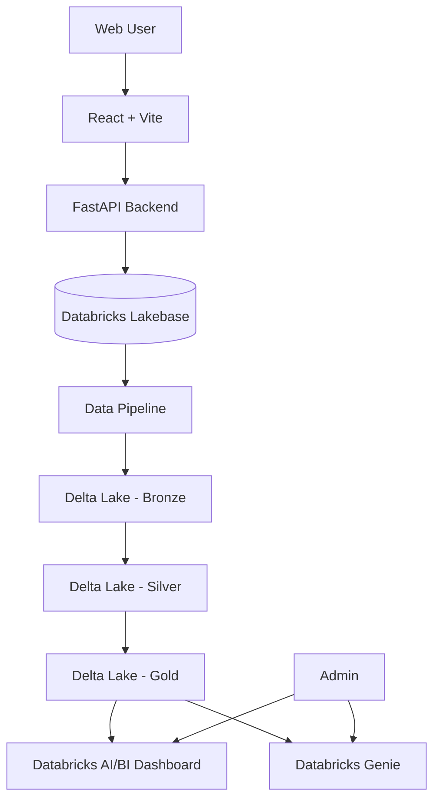

# Fashion E-Commerce Platform

## 1. Giới thiệu

Dự án xây dựng một **nền tảng thương mại điện tử đa nhà bán hàng dành cho thời trang**, lấy cảm hứng từ mô hình marketplace như Shopee nhưng thu gọn phạm vi để phù hợp với đồ án.

Hệ thống cho phép:

- Người mua tìm kiếm, xem và đặt mua sản phẩm thời trang.
- Chủ shop tự quản lý sản phẩm, nguồn hàng, kho, đơn hàng và hoạt động kinh doanh của shop.
- Admin quản lý toàn bộ nền tảng.
- Dữ liệu vận hành được lưu trên **Databricks Lakebase**.
- Dữ liệu phân tích được xử lý trên **Delta Lake** theo kiến trúc Medallion.
- Báo cáo được hiển thị qua **Databricks AI/BI Dashboard**.
- **Databricks Genie** được sử dụng như trợ lý AI để truy vấn dữ liệu bằng ngôn ngữ tự nhiên.

---

## 2. Mục tiêu

Xây dựng một hệ thống thương mại điện tử thời trang có khả năng:

1. Hỗ trợ đầy đủ quy trình mua và bán hàng cơ bản.
2. Cho phép nhiều shop hoạt động độc lập trên cùng một nền tảng.
3. Quản lý tồn kho và nguồn hàng riêng cho từng shop.
4. Theo dõi doanh thu, đơn hàng và hiệu quả kinh doanh.
5. Tách dữ liệu vận hành và dữ liệu phân tích.
6. Tích hợp AI để hỗ trợ truy vấn dữ liệu bằng ngôn ngữ tự nhiên.

---

## 3. Đối tượng sử dụng

### Người mua hàng

- Đăng ký / đăng nhập.
- Xem danh sách sản phẩm.
- Tìm kiếm và lọc sản phẩm.
- Xem chi tiết sản phẩm.
- Chọn biến thể theo size và màu sắc.
- Thêm sản phẩm vào giỏ hàng.
- Đặt hàng.
- Theo dõi trạng thái đơn hàng.
- Xem lịch sử mua hàng.
- Đánh giá và nhận xét sản phẩm sau khi nhận hàng.

> Để đơn giản hóa nghiệp vụ, **một giỏ hàng chỉ chứa sản phẩm của một shop**.

### Chủ shop

- Quản lý thông tin shop.
- Quản lý sản phẩm.
- Quản lý biến thể sản phẩm.
- Quản lý giá bán.
- Quản lý đơn hàng.
- Cập nhật trạng thái xử lý đơn.
- Quản lý nhà cung cấp.
- Quản lý nhập hàng.
- Quản lý kho hàng.
- Theo dõi tồn kho.
- Nhận cảnh báo khi sản phẩm sắp hết hàng.
- Theo dõi doanh thu và hiệu quả kinh doanh của shop.

> Mỗi shop quản lý **một kho riêng**.

### Admin hệ thống

- Quản lý người dùng.
- Quản lý các shop.
- Theo dõi sản phẩm và đơn hàng toàn hệ thống.
- Theo dõi hoạt động của nền tảng.
- Xem báo cáo và dashboard tổng thể.
- Sử dụng Databricks Genie để truy vấn dữ liệu toàn hệ thống.

---

## 4. Phạm vi chức năng

### Chức năng cơ bản

- Authentication & Authorization.
- Quản lý tài khoản người dùng.
- Quản lý shop.
- Quản lý sản phẩm thời trang.
- Quản lý category.
- Quản lý size và color.
- Giỏ hàng.
- Checkout.
- Thanh toán mô phỏng.
- Quản lý đơn hàng.
- Theo dõi trạng thái giao hàng.
- Rating & Review.

### Chức năng nâng cao

- Supplier Management.
- Purchase / Restock Management.
- Inventory Management.
- Low Stock Alert.
- Analytics Dashboard.
- Databricks Genie AI Assistant.

---

## 5. Luồng đơn hàng

Trạng thái đơn hàng dự kiến:

```text
PENDING
   ↓
CONFIRMED
   ↓
PREPARING
   ↓
SHIPPING
   ↓
DELIVERED
```

Đơn hàng cũng có thể chuyển sang:

```text
CANCELLED
```

Thanh toán và vận chuyển hiện được **mô phỏng**, chưa tích hợp cổng thanh toán hoặc đơn vị vận chuyển thật.

---

## 6. Kiến trúc tổng thể



---

## 7. Kiến trúc dữ liệu

### Operational Layer

**Databricks Lakebase** được sử dụng cho dữ liệu vận hành cần đọc/ghi thường xuyên, ví dụ:

- users
- shops
- products
- product_variants
- suppliers
- inventory
- purchase_orders
- orders
- order_items
- reviews

### Analytical Layer

Dữ liệu được đưa sang **Delta Lake** và xử lý theo kiến trúc:

```text
Lakebase
   ↓
Bronze
   ↓
Silver
   ↓
Gold
   ├── AI/BI Dashboard
   └── Databricks Genie
```

#### Bronze

Lưu dữ liệu nguồn gần với trạng thái ban đầu.

#### Silver

Làm sạch, chuẩn hóa và xử lý dữ liệu nghiệp vụ.

#### Gold

Tạo các bảng phục vụ báo cáo và phân tích, ví dụ:

- Doanh thu theo thời gian.
- Doanh thu theo shop.
- Số lượng đơn hàng.
- Tỷ lệ hủy đơn.
- Sản phẩm bán chạy.
- Tồn kho thấp.
- Hiệu quả kinh doanh của shop.

---

## 8. Databricks Genie

Databricks Genie được tích hợp để hỗ trợ truy vấn dữ liệu bằng ngôn ngữ tự nhiên.

### Ví dụ câu hỏi của Admin

- Doanh thu toàn hệ thống tháng này là bao nhiêu?
- Top 10 shop có doanh thu cao nhất là những shop nào?
- Có bao nhiêu đơn hàng đang giao?
- Sản phẩm nào bán chạy nhất?
- Shop nào có tỷ lệ hủy đơn cao?
- Những sản phẩm nào đang có tồn kho thấp?

### Phạm vi ban đầu

Trong phiên bản đầu:

- Genie được ưu tiên cho **Admin**.
- Quyền truy vấn của Admin có thể xem dữ liệu toàn hệ thống.

Trong phiên bản mở rộng:

- Chủ shop có thể sử dụng Genie.
- Chủ shop chỉ được phép truy vấn dữ liệu thuộc shop của mình.

---

## 9. Công nghệ dự kiến

| Thành phần | Công nghệ |
|---|---|
| Frontend | React + Vite |
| Backend | FastAPI |
| Operational Database | Databricks Lakebase |
| Analytical Storage | Delta Lake |
| Data Architecture | Bronze / Silver / Gold |
| Dashboard | Databricks AI/BI Dashboard |
| AI Assistant | Databricks Genie |
| Containerization | Docker / Docker Compose |
| Development Environment | Docker Desktop |
| API | REST API |

---

## 10. Các yêu cầu phi chức năng

- Phân quyền rõ ràng giữa Buyer, Shop Owner và Admin.
- Chủ shop không được truy cập dữ liệu của shop khác.
- Dữ liệu đơn hàng và tồn kho phải đảm bảo tính nhất quán.
- Hệ thống có khả năng mở rộng thêm nhiều shop.
- Giao diện web responsive.
- API được thiết kế rõ ràng, dễ kiểm thử và bảo trì.
- Phần analytics không làm ảnh hưởng đến workload vận hành chính.

---

## 11. Hướng phát triển

Một số chức năng có thể mở rộng sau phiên bản đầu:

- Genie dành cho Shop Owner với phân quyền theo shop.
- Recommendation System.
- Voucher / Promotion.
- Tích hợp cổng thanh toán thật.
- Tích hợp đơn vị vận chuyển.
- Multi-warehouse.
- Chat giữa người mua và shop.
- Notification real-time.

---

## 12. Thông tin dự án

**Tên dự án:** Hệ thống thương mại điện tử dành cho thời trang  
**Trạng thái:** Đang triển khai
**Ngày bắt đầu:** 17/08/2026  
**Deadline dự kiến:** 12/10/2026  

### Thành viên

- Nguyễn Trường Sơn - 23010313
- Nguyễn Ngọc Minh - 23010623

### Giảng viên hướng dẫn

- Nguyễn Văn Sơn

---

## 13. Ghi chú

Phạm vi của dự án được giới hạn trong lĩnh vực **thời trang** để tập trung vào chất lượng nghiệp vụ, kiến trúc dữ liệu và khả năng tích hợp Databricks thay vì cố gắng tái tạo toàn bộ chức năng của một nền tảng thương mại điện tử lớn.
