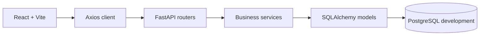

# Architecture

**Trạng thái:** In progress
**Phạm vi đã triển khai:** Nền tảng A–B, backend C0–C5, khung frontend D1 và phần đầu D2.

## Thành phần đang chạy

Backend tách router, schema, service và model. Router nhận request, dùng dependency xác thực/phân quyền và gọi service. Service xử lý nghiệp vụ, sở hữu transaction; model và Alembic quản lý schema. Các endpoint hiện có được ghi trong [`API.md`](API.md), còn cấu trúc bảng nằm trong [`DATABASE.md`](DATABASE.md).

Frontend dùng `BrowserRouter` để định tuyến. `AuthProvider` đọc và lưu `{token, role, shop_id}` trong `localStorage`, rồi điều hướng theo vai trò sau khi đăng nhập; `RequireRole` chuyển người chưa đăng nhập tới `/login` và người sai vai trò về trang của vai trò đó. Đây là điều hướng giao diện; backend vẫn xác thực token và quyền trên từng request. Axios client gắn token vào header `Authorization` và xóa phiên, chuyển tới `/login` khi API trả `401`.

`/login` và `/register` dùng API xác thực, hiện lỗi API trên form; đăng ký xong chuyển tới đăng nhập. Lỗi `401` từ form đăng nhập được giữ lại cho form hiển thị. `/` gọi API catalog khi tìm kiếm, lọc, sắp xếp hoặc đổi trang; `/products/:id` hiển thị dữ liệu sản phẩm và giá, tồn kho theo màu và size được chọn. Giá hiển thị bằng `formatCurrency`.

API giỏ hàng C3 đã triển khai trong `cart_service.py`, với transaction tuần tự theo buyer để bảo vệ quy tắc một giỏ một shop. Checkout C4 nằm trong `checkout_service.py`; thao tác khóa buyer và giỏ trước khi tạo đơn, trừ kho bằng conditional update và commit toàn bộ snapshot đơn, lịch sử trạng thái cùng việc xóa giỏ trong một transaction. Quy tắc chi tiết nằm trong [`BUSINESS_RULES.md`](BUSINESS_RULES.md).

State machine C5 nằm riêng trong `order_service.py`. Các endpoint đọc áp dụng phạm vi buyer/shop/admin từ user và shop trong database; mọi transition khóa order, kiểm tra bảng chuyển trạng thái, thực hiện side effect tồn kho/thanh toán và ghi history trong cùng transaction.

Frontend chưa nối API giỏ hàng/checkout/đơn hàng: nút thêm vào giỏ vẫn bị khóa, các trang cart, checkout và order thuộc bước D2 tiếp theo. Danh sách review cùng giao diện nghiệp vụ shop và admin vẫn là **Planned**. Rating trung bình trên catalog và chi tiết lấy từ C2; dashboard shop/admin hiện vẫn là màn hình khung.

Lakebase và pipeline Bronze/Silver/Gold vẫn là **Planned** theo phần E của [`PLANNING.md`](PLANNING.md). Môi trường development hiện dùng PostgreSQL trong Docker Compose.
