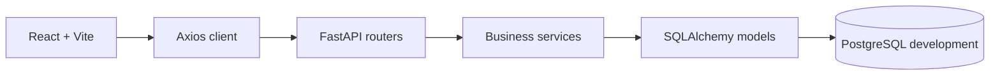

# Architecture

**Trạng thái:** In progress
**Phạm vi đã triển khai:** Nền tảng A–B, backend C0–C2, khung frontend D1 và phần đầu D2.

## Thành phần đang chạy

Backend tách router, schema, service và model. Router nhận request, dùng dependency xác thực/phân quyền và gọi service. Service xử lý nghiệp vụ, sở hữu transaction; model và Alembic quản lý schema. Các endpoint hiện có được ghi trong [`API.md`](API.md), còn cấu trúc bảng nằm trong [`DATABASE.md`](DATABASE.md).

Frontend dùng `BrowserRouter` để định tuyến. `AuthProvider` đọc và lưu `{token, role, shop_id}` trong `localStorage`, rồi điều hướng theo vai trò sau khi đăng nhập; `RequireRole` chuyển người chưa đăng nhập tới `/login` và người sai vai trò về trang của vai trò đó. Đây là điều hướng giao diện; backend vẫn xác thực token và quyền trên từng request. Axios client gắn token vào header `Authorization` và xóa phiên, chuyển tới `/login` khi API trả `401`.

`/login` và `/register` dùng API xác thực, hiện lỗi API trên form; đăng ký xong chuyển tới đăng nhập. Lỗi `401` từ form đăng nhập được giữ lại cho form hiển thị. `/` gọi API catalog khi tìm kiếm, lọc, sắp xếp hoặc đổi trang; `/products/:id` hiển thị dữ liệu sản phẩm và giá, tồn kho theo màu và size được chọn. Giá hiển thị bằng `formatCurrency`.

Giao diện giỏ hàng, checkout, đơn hàng và danh sách review vẫn là **Planned**. Nút thêm vào giỏ đang bị khóa; dashboard shop/admin hiện vẫn là màn hình khung.

Lakebase và pipeline Bronze/Silver/Gold vẫn là **Planned** theo phần E của [`PLANNING.md`](PLANNING.md). Môi trường development hiện dùng PostgreSQL trong Docker Compose.
