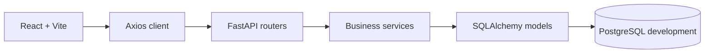

# Architecture

**Trạng thái:** In progress
**Phạm vi đã triển khai:** Nền tảng A–B, toàn bộ backend C0–C10, frontend D1, toàn bộ luồng BUYER D2 và giao diện SHOP_OWNER D3.

## Thành phần đang chạy

Backend tách router, schema, service và model. Router nhận request, dùng dependency xác thực/phân quyền và gọi service. Service xử lý nghiệp vụ, sở hữu transaction; model và Alembic quản lý schema. Các endpoint hiện có được ghi trong [`API.md`](API.md), còn cấu trúc bảng nằm trong [`DATABASE.md`](DATABASE.md).

Frontend dùng `BrowserRouter` để định tuyến. `AuthProvider` đọc và lưu `{token, role, shop_id}` trong `localStorage`, rồi điều hướng theo vai trò sau khi đăng nhập; `RequireRole` chuyển người chưa đăng nhập tới `/login` và người sai vai trò về trang của vai trò đó. Đây là điều hướng giao diện; backend vẫn xác thực token và quyền trên từng request. Axios client gắn token vào header `Authorization` và xóa phiên, chuyển tới `/login` khi API trả `401`.

`/login` và `/register` dùng API xác thực, hiện lỗi API trên form; đăng ký xong chuyển tới đăng nhập. Lỗi `401` từ form đăng nhập được giữ lại cho form hiển thị. `/` gọi API catalog khi tìm kiếm, lọc, sắp xếp hoặc đổi trang; `/products/:id` hiển thị dữ liệu sản phẩm, review và giá/tồn kho theo variant được chọn, đồng thời thêm variant vào giỏ. Khi API trả `CART_DIFFERENT_SHOP`, giao diện chỉ xóa giỏ cũ rồi thêm lại sau khi buyer xác nhận.

Luồng BUYER D2 còn lại tách theo page: `/cart` tải giá và tồn kho hiện tại, chặn số lượng vượt tồn rồi cho sửa/xóa; `/checkout` gửi thông tin người nhận và hiển thị nguyên văn lỗi `409` thiếu hàng; `/orders` lọc/phân trang và chỉ hiện nút hủy cho `PENDING`; `/orders/:id` hiển thị snapshot, lịch sử trạng thái và chỉ cho đánh giá item của đơn `DELIVERED` khi `review_id=null`. Mọi route ghi dữ liệu BUYER được bọc `RequireRole`; backend vẫn là nơi quyết định quyền thật. Giá hiển thị qua `formatCurrency`.

API catalog có hai mặt đọc: endpoint public chỉ trả dữ liệu đang hoạt động, còn `GET /shop/products` lấy shop từ database và trả cả product/variant đã ẩn để D3 quản lý được sau khi reload. API giỏ hàng C3 đã triển khai trong `cart_service.py`, với transaction tuần tự theo buyer để bảo vệ quy tắc một giỏ một shop. Checkout C4 nằm trong `checkout_service.py`; thao tác khóa buyer và giỏ, lấy khóa đọc chia sẻ trên catalog liên quan, trừ kho bằng conditional update rồi commit toàn bộ snapshot đơn, lịch sử trạng thái cùng việc xóa giỏ trong một transaction. Quy tắc chi tiết nằm trong [`BUSINESS_RULES.md`](BUSINESS_RULES.md).

State machine C5 nằm riêng trong `order_service.py`. Các endpoint đọc áp dụng phạm vi buyer/shop/admin từ user và shop trong database; mọi transition khóa order, kiểm tra bảng chuyển trạng thái, thực hiện side effect tồn kho/thanh toán và ghi history trong cùng transaction. Chi tiết đơn eager-load review của từng order item và trả `review_id`, giúp D2 quyết định chính xác item nào còn được đánh giá.

Tồn kho và cảnh báo hết hàng C6 nằm trong `inventory_service.py`: hai hàm `check_low_stock` và `resolve_alerts_if_ok` được `checkout_service.py` và `order_service.py` gọi ngay sau khi transaction trừ/cộng kho của chúng đã commit, không nằm trong transaction gốc — lỗi tạo/giải quyết cảnh báo không thể làm rollback hoặc fail thao tác đã thành công. Mỗi hàm khóa dòng inventory trong transaction riêng để tuần tự hóa với checkout/hoàn kho đồng thời. Router `inventory.py` chỉ phục vụ SHOP_OWNER và lấy `shop_id` từ `get_current_shop()`.

Supplier và nhập hàng C7 tách thành hai cặp router/service riêng: `suppliers.py`/`supplier_service.py` (CRUD, soft delete) và `purchase_orders.py`/`purchase_service.py`. `purchase_service.transition_purchase_order()` là hàm duy nhất đổi trạng thái phiếu nhập, dùng cùng khuôn mẫu khóa dòng `FOR UPDATE` và bảng chuyển trạng thái như `order_service.transition_order()` ở C5; khi nhận hàng (`ORDERED → RECEIVED`) nó gọi lại `inventory_service.resolve_alerts_if_ok()` của C6 sau khi commit.

Review C8 nằm trong `review_service.py`/`routers/reviews.py`. `product_id` của review lấy từ `order_item.variant.product_id` trong database chứ không nhận từ client. Rating trung bình không lưu cột riêng: cả chi tiết sản phẩm (C2) và danh sách review (C8) tính trực tiếp bằng `AVG(rating)` tại thời điểm đọc nên luôn khớp nhau.

Số liệu thống kê shop C9 nằm trong `shop_stats_service.py`/`routers/shop_stats.py`, chỉ đọc dữ liệu (không ghi), dùng chung một định nghĩa metric cho `revenue`, `order_count`, `cancel_rate`, `aov`, `revenue-by-day` và `top-products` theo đúng Planning C9 — định nghĩa này sẽ được tái sử dụng nguyên vẹn khi xây Gold layer, Dashboard và Genie ở phần E. Chuyển đổi giờ Việt Nam dùng `func.timezone('Asia/Ho_Chi_Minh', ...)` ngay trong câu query Postgres, không tính bằng Python để tránh lệch múi giờ giữa ứng dụng và database.

Admin C10 nằm trong `admin_service.py`/`routers/admin.py`, dùng `require_role('ADMIN')` cho mọi endpoint. Thay vì viết lại truy vấn đơn hàng và thống kê, nó gọi lại `order_service.list_all_orders()` (thêm ở C5) và `shop_stats_service.get_overview()` với `shop_id=None`, nên phạm vi backend C0–C10 đã hoàn chỉnh theo Planning — phần còn lại của dự án là Phần D (frontend đầy đủ) và Phần E (data platform).

Frontend D2 đã nối đủ API catalog, giỏ hàng, checkout, đơn hàng, hủy đơn và review cho BUYER. Frontend D3 gom các route `/shop/*` dưới một layout route: `RequireRole role="SHOP_OWNER"` bọc `ShopLayout`, layout này hiển thị sidebar và `<Outlet>` cho bảy trang `dashboard`, `products`, `orders`, `inventory`, `alerts`, `suppliers`, `purchase-orders` trong `src/pages/shop/`. Nếu phiên đăng nhập có `shop_id=null`, layout chỉ hiện form tạo shop (`POST /shops`) và cập nhật `shop_id` trong phiên sau khi tạo thành công; giá trị này chỉ dùng cho giao diện vì backend luôn lấy shop từ database. Dashboard gọi C9 với khoảng ngày mặc định 30 ngày gần nhất theo ngày trình duyệt và vẽ doanh thu theo ngày bằng SVG nội bộ (ngày không có đơn giao hiển thị 0), không thêm thư viện biểu đồ. Nút chuyển trạng thái đơn hàng và phiếu nhập lấy từ bảng ánh xạ phản chiếu đúng transition backend cho phép (`shopOrderActions.js`, `purchaseOrderPresentation.js`); tồn kho chỉ sửa ngưỡng, số lượng chỉ đổi qua đơn hàng hoặc phiếu nhập. Giao diện ADMIN D4 vẫn là **Planned**; dashboard admin hiện vẫn là màn hình khung.

Lakebase và pipeline Bronze/Silver/Gold vẫn là **Planned** theo phần E của [`PLANNING.md`](PLANNING.md). Môi trường development hiện dùng PostgreSQL trong Docker Compose.
