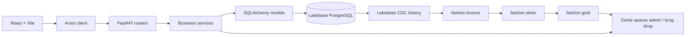

# Architecture

**Trạng thái:** In progress
**Phạm vi đã triển khai:** Nền tảng A–B, toàn bộ backend C0–C10, P1–P4, frontend D1–D4 (BUYER, SHOP_OWNER, ADMIN), data E1–E4 và chatbot Genie trên website admin/shop.

## Thành phần đang chạy

Ảnh sản phẩm mở rộng dùng router/service riêng để nhận file và phục vụ media công khai. Ảnh chính tiếp tục dùng `products.image_url`, ảnh phụ nằm ở bảng riêng để giữ schema CDC của product. Binary lưu trên filesystem backend được mount ra host trong Compose. Frontend chọn file qua Axios client dùng chung và hiện gallery ở chi tiết. Contract và giới hạn ở [API ảnh sản phẩm](API.md#ảnh-sản-phẩm); cấu hình/backup ở [Deployment Guide](DEPLOYMENT_GUIDE.md#lưu-trữ-ảnh-sản-phẩm).

```mermaid
flowchart LR
    Browser[React + Vite] --> Client[Axios client]
    Client --> API[FastAPI routers]
    API --> Services[Business services]
    Services --> Models[SQLAlchemy models]
    Models --> DB[(Lakebase PostgreSQL)]
    DB --> CDC[Lakebase CDC history]
    CDC --> Bronze[fashion.bronze]
    Bronze --> Silver[fashion.silver]
    Silver --> Gold[fashion.gold]
    Gold --> Genie[Genie spaces admin / từng shop]
    Services --> Genie
```

Backend tách router, schema, service và model. Router nhận request, dùng dependency xác thực/phân quyền và gọi service. Service xử lý nghiệp vụ, sở hữu transaction; model và Alembic quản lý schema. Các endpoint hiện có được ghi trong [`API.md`](API.md), còn cấu trúc bảng nằm trong [`DATABASE.md`](DATABASE.md).

Backend/frontend vẫn chạy local trong Docker. Cấu hình `.env` trên máy đã chuyển database ứng dụng sang Lakebase `fashion` qua SSL với role runtime `daln_app`; PostgreSQL Docker giữ dữ liệu local để dự phòng và database `fashion_test` cho test. Compose dùng nguyên `DATABASE_URL`; `.env.example` vẫn dành cho development local. Quy trình cấu hình/cutover nằm ở [`DEPLOYMENT_GUIDE.md`](DEPLOYMENT_GUIDE.md#kết-nối-web-với-lakebase).

P1 hồ sơ/sổ địa chỉ nằm trong `routers/users.py`, `profile_service.py` và model `UserAddress`; endpoint địa danh public nằm trong `routers/locations.py`/`location_service.py`. Bộ dữ liệu 2 cấp được đóng gói tại `app/data/vn_admin_units_2025.json`, có script tái tạo từ nguồn được khóa commit nên runtime không cần mạng. Frontend `/account/profile` dùng combobox tìm kiếm không phân biệt dấu và chỉ giữ mã của lựa chọn chính thức. Checkout tải profile/sổ địa chỉ để tự điền nhưng vẫn gửi snapshot qua contract cũ, không nối order bằng foreign key tới địa chỉ.

P2 wishlist nằm riêng trong `routers/wishlist.py`, `wishlist_service.py` và model `WishlistItem`. Service chỉ lấy buyer từ dependency xác thực, trả thông tin catalog hiện tại bằng truy vấn tổng hợp và giữ item khi product/shop bị ẩn. Frontend dùng một hook chung để tải ID yêu thích một lần cho từng trang catalog/chi tiết; trang `/wishlist` dùng response đầy đủ. Wishlist lưu ở cấp product và chuyển buyer sang chi tiết để chọn variant, nên không sao chép logic tồn kho hay quy tắc mỗi lần thanh toán một shop.

P3 sở thích mua sắm nằm trong `routers/preferences.py`, `preference_service.py` và ba model preference. Service khóa user rồi thay thế category/color/price range trong một transaction; options màu được suy ra từ catalog đang hoạt động và hợp nhất với màu đã lưu. Frontend `/account/preferences` là form nhiều lựa chọn; P4 đọc dữ liệu này để gợi ý.

P4 nằm riêng trong `routers/recommendations.py` và `recommendation_service.py`, không đổi schema. Service đọc sở thích bằng service P3; query SQL tổng hợp theo product để mỗi tiêu chí màu/giá chỉ đóng góp một điểm, lọc catalog còn hàng, xếp điểm/ngày/ID trước giới hạn. Kết quả dùng `ProductSummary` hiện có. Frontend `RecommendedProducts` tải độc lập trên catalog BUYER và gỡ khi phiên thay đổi; `ProductCard` dùng chung cho gợi ý và catalog, cùng trạng thái từ một hook wishlist trên page. Filter của catalog không tác động request gợi ý. Quy tắc chuẩn nằm ở [Planning C1e](PLANNING.md#c1e-router-recommendationspy--p4-gợi-ý-theo-sở-thích).

Frontend dùng `BrowserRouter` để định tuyến. `AuthProvider` đọc và lưu `{token, role, shop_id}` trong `localStorage`, rồi điều hướng theo vai trò sau khi đăng nhập; `RequireRole` chuyển người chưa đăng nhập tới `/login` và người sai vai trò về trang của vai trò đó. Đây là điều hướng giao diện; backend vẫn xác thực token và quyền trên từng request. Axios client gắn token vào header `Authorization` và xóa phiên, chuyển tới `/login` khi API trả `401`.

Luồng auth email nằm trong `auth_service` (token/transaction), `email_service` (Gmail SMTP) và router chỉ điều phối request, rate limit, gửi mail. Resend, forgot và thông báo đổi mật khẩu gửi bằng background task sau response để response chung không phụ thuộc thời gian SMTP; đăng ký gửi trực tiếp để báo `503` khi cấu hình mail lỗi. Frontend có các route `/verify-email-sent`, `/verify-email`, `/forgot-password`, `/reset-password`. Email đặt token trong URL fragment; page đọc token một lần, xóa fragment khỏi thanh địa chỉ rồi gửi qua POST. Token database chỉ là SHA-256 và reset mật khẩu đổi `auth_version` để backend từ chối JWT cũ. Rate limiter local dùng bộ nhớ và khóa thread, chưa dành cho triển khai nhiều instance.

`/login` và `/register` dùng API xác thực, hiện lỗi API trên form; đăng ký xong chuyển tới trang nhắc kiểm tra email. Lỗi `401` từ form đăng nhập được giữ lại cho form hiển thị; lỗi email chưa xác minh có link resend. `/` gọi API catalog khi tìm kiếm, lọc, sắp xếp hoặc đổi trang; `/products/:id` hiển thị dữ liệu sản phẩm, review và giá/tồn kho theo variant được chọn, đồng thời thêm variant vào giỏ. Khách lưu variant/số lượng trên trình duyệt; BUYER gọi API giỏ, giữ hàng thuộc shop khác và chọn một shop khi checkout.

Luồng BUYER D2 còn lại tách theo page: `/cart` tải giá và tồn kho hiện tại, chặn số lượng vượt tồn rồi cho sửa/xóa; `/checkout` gửi thông tin người nhận và hiển thị nguyên văn lỗi `409` thiếu hàng; `/orders` lọc/phân trang và chỉ hiện nút hủy cho `PENDING`; `/orders/:id` hiển thị snapshot, lịch sử trạng thái và chỉ cho đánh giá item của đơn `DELIVERED` khi `review_id=null`. Route ghi dữ liệu tài khoản BUYER được bọc `RequireRole`; `/cart` dùng `BuyerRoute` để khách cũng lưu được giỏ tạm; backend vẫn là nơi quyết định quyền thật. Giá hiển thị qua `formatCurrency`.

API catalog có hai mặt đọc: endpoint public chỉ trả dữ liệu đang hoạt động, còn `GET /shop/products` lấy shop từ database và trả cả product/variant đã ẩn để D3 quản lý được sau khi reload. API giỏ hàng C3 đã triển khai trong `cart_service.py`, với transaction tuần tự theo buyer để bảo vệ giỏ dùng chung cho nhiều shop. Checkout C4 nằm trong `checkout_service.py`; thao tác khóa buyer và giỏ, lấy khóa đọc chia sẻ trên catalog liên quan, trừ kho bằng conditional update rồi commit toàn bộ snapshot đơn, lịch sử trạng thái cùng việc xóa item của shop đã chọn trong một transaction. Quy tắc chi tiết nằm trong [`BUSINESS_RULES.md`](BUSINESS_RULES.md).

State machine C5 nằm riêng trong `order_service.py`. Các endpoint đọc áp dụng phạm vi buyer/shop/admin từ user và shop trong database; mọi transition khóa order, kiểm tra bảng chuyển trạng thái, thực hiện side effect tồn kho/thanh toán và ghi history trong cùng transaction. Chi tiết đơn eager-load review của từng order item và trả `review_id`, giúp D2 quyết định chính xác item nào còn được đánh giá.

Tồn kho và cảnh báo hết hàng C6 nằm trong `inventory_service.py`: hai hàm `check_low_stock` và `resolve_alerts_if_ok` được `checkout_service.py` và `order_service.py` gọi ngay sau khi transaction trừ/cộng kho của chúng đã commit, không nằm trong transaction gốc — lỗi tạo/giải quyết cảnh báo không thể làm rollback hoặc fail thao tác đã thành công. Mỗi hàm khóa dòng inventory trong transaction riêng để tuần tự hóa với checkout/hoàn kho đồng thời. Router `inventory.py` chỉ phục vụ SHOP_OWNER và lấy `shop_id` từ `get_current_shop()`.

Supplier và nhập hàng C7 tách thành hai cặp router/service riêng: `suppliers.py`/`supplier_service.py` (CRUD, soft delete) và `purchase_orders.py`/`purchase_service.py`. `purchase_service.transition_purchase_order()` là hàm duy nhất đổi trạng thái phiếu nhập, dùng cùng khuôn mẫu khóa dòng `FOR UPDATE` và bảng chuyển trạng thái như `order_service.transition_order()` ở C5; khi nhận hàng (`ORDERED → RECEIVED`) nó gọi lại `inventory_service.resolve_alerts_if_ok()` của C6 sau khi commit.

Review C8 nằm trong `review_service.py`/`routers/reviews.py`. `product_id` của review lấy từ `order_item.variant.product_id` trong database chứ không nhận từ client. Rating trung bình không lưu cột riêng: cả chi tiết sản phẩm (C2) và danh sách review (C8) tính trực tiếp bằng `AVG(rating)` tại thời điểm đọc nên luôn khớp nhau.

Số liệu thống kê shop C9 nằm trong `shop_stats_service.py`/`routers/shop_stats.py`, chỉ đọc dữ liệu (không ghi), dùng chung một định nghĩa metric cho `revenue`, `order_count`, `cancel_rate`, `aov`, `revenue-by-day` và `top-products` theo đúng Planning C9 — định nghĩa này được tái sử dụng trong Gold và chatbot Genie; Dashboard Databricks E5 còn Planned. Chuyển đổi giờ Việt Nam dùng `func.timezone('Asia/Ho_Chi_Minh', ...)` ngay trong câu query Postgres, không tính bằng Python để tránh lệch múi giờ giữa ứng dụng và database.

Admin C10 nằm trong `admin_service.py`/`routers/admin.py`, dùng `require_role('ADMIN')` cho mọi endpoint. Thay vì viết lại truy vấn đơn hàng và thống kê, nó gọi lại `order_service.list_all_orders()` (thêm ở C5) và `shop_stats_service.get_overview()` với `shop_id=None`, nên phạm vi backend C0–C10 đã hoàn chỉnh theo Planning. Frontend D1–D4 cũng đã nối đủ các contract tương ứng; phần lớn còn lại của dự án là Phần E (data platform) và Phần G (Docker/demo).

Frontend D2 đã nối đủ API catalog, giỏ hàng, checkout, đơn hàng, hủy đơn và review cho BUYER. Catalog ưu tiên ảnh sản phẩm, hiển thị giá/rating theo thứ bậc rõ ràng và thu gọn bộ lọc sau nút có `aria-expanded` trên màn hình nhỏ; thao tác xóa lọc đưa query về trạng thái mặc định. Mỗi lần đổi pathname, app cuộn viewport về đầu trang; thao tác hủy đơn khóa dialog trong lúc request đang chạy để tránh gửi trùng. Frontend D3 gom các route `/shop/*` dưới một layout route: `RequireRole role="SHOP_OWNER"` bọc `ShopLayout`, layout này hiển thị sidebar và `<Outlet>` cho các trang quản lý trong `src/pages/shop/` và trang chatbot dùng chung `src/pages/ChatbotPage.jsx`. Nếu phiên đăng nhập có `shop_id=null`, layout chỉ hiện form tạo shop (`POST /shops`) và cập nhật `shop_id` trong phiên sau khi tạo thành công; giá trị này chỉ dùng cho giao diện vì backend luôn lấy shop từ database. Dashboard shop/admin dùng `dashboard_service.py`, `dashboard_queries.py` và `schemas/dashboard.py`; API `/shop/stats/dashboard` lấy shop từ database, `/admin/stats/dashboard` yêu cầu ADMIN. Hai trang dùng chung component/hook trong `src/components/dashboard/`, đọc trực tiếp database vận hành, giữ metric C9 và bổ sung kỳ trước, biểu đồ bán hàng, tồn đọng, ưu tiên nhập hàng; admin có thêm đóng góp từng shop. Chi tiết contract, mục đích và ngày tính ở [`WEB_DASHBOARDS.md`](WEB_DASHBOARDS.md). Chart dùng SVG nội bộ, không thêm dependency. Nút chuyển trạng thái đơn hàng và phiếu nhập lấy từ bảng ánh xạ phản chiếu đúng transition backend cho phép (`shopOrderActions.js`, `purchaseOrderPresentation.js`); tồn kho chỉ sửa ngưỡng, số lượng chỉ đổi qua đơn hàng hoặc phiếu nhập. Trang sản phẩm chỉ mở form tạo/sửa sau khi tải được danh mục; trang nhập hàng chỉ mở form sau khi tải thành công supplier và inventory. Tồn kho, cảnh báo và nhà cung cấp lọc trên dữ liệu shop đã tải rồi phân trang 10 dòng; sản phẩm, đơn hàng và phiếu nhập tiếp tục dùng bộ lọc/phân trang phía server. Các trang danh sách Shop/Admin tách lỗi tải dữ liệu khỏi lỗi thao tác: lỗi tải không giữ hàng cũ trên màn hình, còn lỗi thao tác không làm biến mất dữ liệu hiện tại. Bảng giữ cấu trúc `<td>` chuẩn, chỉ dùng flex trong phần tử con của ô thao tác để đường viền và cột không bị lệch; font tiêu đề/bảng quản trị dùng sans-serif thống nhất và bảng tự cuộn ngang trong khung trên màn hình hẹp. Layout responsive giới hạn min-content của grid và cho menu quản lý tự xuống dòng, tránh trang bị tràn ngang khi nhãn hoặc dữ liệu dài. Frontend D4 dùng cùng mô hình layout route: `RequireRole role="ADMIN"` bọc `AdminLayout` với các trang quản lý trong `src/pages/admin/` và `/admin/chatbot` dùng chung `ChatbotPage`. `ShopLayout` và `AdminLayout` dùng chung `SidebarLayout`; hai dashboard dùng chung `StatCards` và `DateRangeFields` nên số liệu C9/C10 hiển thị cùng định dạng. Khóa/mở user và shop cập nhật dòng theo response `PATCH`; lỗi như tự khóa chính mình hiển thị nguyên văn từ backend. Danh sách shop admin tìm theo tên, lọc trạng thái và phân trang phía server. Bộ lọc shop ở trang đơn toàn hệ thống đọc lần lượt toàn bộ các trang từ `GET /admin/shops`, tách lỗi tải shop khỏi lỗi tải đơn và cho phép xóa toàn bộ bộ lọc. Link Databricks Dashboard và Genie đọc từ `VITE_DATABRICKS_DASHBOARD_URL`/`VITE_DATABRICKS_GENIE_URL`; khi biến rỗng, dashboard admin ghi rõ "chưa được cấu hình" thay vì hiện link, vì link ngoài chưa được cấu hình. Chatbot website ở `/admin/chatbot` và `/shop/chatbot` dùng cấu hình backend riêng, không phụ thuộc link này.

E1 đọc Lakebase CDC history trên S3 rồi MERGE 13 bảng Bronze bằng Spark serverless với checkpoint bền vững. E2 MERGE 7 bảng Silver, bỏ qua các bảng không đổi dependency. E3 có sáu bảng Gold overwrite theo metric C9. Job chạy E1→E2→E3; khi preflight xác minh E1/E2 không đổi, chỉ Gold chạy qua SQL warehouse đã cấu hình và không khởi tạo Spark notebook. Setup/bằng chứng nằm ở [`DATA_PLATFORM.md`](DATA_PLATFORM.md), nghiệp vụ Silver ở [`E2_SILVER.md`](E2_SILVER.md), Gold ở [`E3_GOLD.md`](E3_GOLD.md). E3 đã nghiệm thu và gate [E4](E4_QUALITY.md) đã PASS 5/5 qua hai lượt Job thật trước khi cấu hình Genie. AI/BI Dashboard E5 còn Planned; dashboard website D3/D4 đọc API vận hành riêng.

Chatbot website dùng `routers/chatbot.py`, `chatbot_service.py`, `genie_client.py` và `genie_config.py`; frontend dùng chung `ChatbotPage` cho hai role qua Axios. Backend suy shop từ user/database và gọi Genie bằng OAuth M2M riêng từng scope. Admin chỉ đọc sáu Gold gốc; các shop dùng chung một Space và sáu Gold view lọc bằng session_user()/mapping Unity Catalog, mỗi shop giữ principal riêng. Token hội thoại có audience riêng, gắn user/scope và được kiểm tra lại mỗi request; không dùng làm token đăng nhập. Lịch sử riêng theo user lưu ở hai bảng chat qua migration 20261006_0009. Worker Compose riêng tự cấp quyền shop; credential quản trị không vào API web. Cấu hình, metric và nghiệm thu nằm ở [Genie Chatbot](GENIE_CHATBOT.md).

Giỏ khách vãng lai dùng localStorage qua `src/cart/guestCart.js`, chỉ lưu variant ID, số lượng, khóa chuyển giỏ và lựa chọn shop. Public `POST /cart/preview` lấy dữ liệu catalog hiện tại. BUYER đăng nhập được chuyển tới giỏ để `POST /cart/merge` gộp toàn bộ trong một transaction; `cart_merges` lưu khóa cùng hash payload theo buyer để retry không cộng lại, kể cả sau checkout. Giỏ tạm chỉ xóa sau xác nhận thành công; mất kết nối giữ nguyên payload/khóa và khóa sửa đến khi thử lại. Role khác không nhập giỏ khách. Contract ở [API](API.md#giỏ-hàng).
