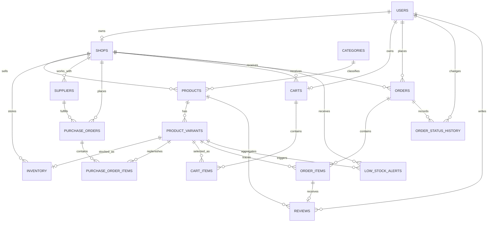

# Database

**Trạng thái:** Implemented
**Phạm vi đã triển khai:** Planning B1–B15

Tài liệu này mô tả schema vận hành đã được triển khai trong SQLAlchemy và Alembic. Đặc tả đầy đủ, bao gồm các bảng chưa triển khai, nằm trong [`PLANNING.md`](PLANNING.md#phần-b--database-từng-bảng-từng-cột).

## Quy ước chung

- PostgreSQL 16 được dùng trong môi trường development; Lakebase là đích triển khai và tương thích giao thức PostgreSQL.
- Khóa chính dùng `BIGINT` tự tăng; PostgreSQL tạo sequence tương ứng khi migration chạy.
- `created_at` và `updated_at` dùng `TIMESTAMPTZ` và lưu thời gian UTC. Các bảng có luồng cập nhật mang cả hai timestamp; bảng snapshot và lịch sử chỉ cần `created_at`.
- Tên constraint được chuẩn hóa để migration và lỗi database dễ truy vết.
- Quan hệ lịch sử không dùng cascade delete. Product sẽ được soft delete bằng `is_active` ở tầng nghiệp vụ.

## Quan hệ đã triển khai



## Bảng và constraint

### `users`

- Email là duy nhất và bắt buộc.
- Mật khẩu chỉ lưu ở cột `password_hash`; seed data đã hash bằng bcrypt và authentication sẽ dùng cùng cơ chế.
- Role chỉ nhận `BUYER`, `SHOP_OWNER` hoặc `ADMIN`.
- `is_active` mặc định là `true`.

### `shops`

- Mỗi shop có đúng một owner.
- `owner_id` là duy nhất nên một user chỉ sở hữu tối đa một shop.
- `is_active` mặc định là `true`.

### `categories`

- Category là danh sách phẳng.
- Tên category là duy nhất và bắt buộc.

### `products`

- Product thuộc một shop và một category.
- `base_price` dùng `NUMERIC(12,0)` và không được âm.
- `is_active` mặc định là `true`; thao tác xóa sau này phải là soft delete.

### `product_variants`

- Variant thuộc một product.
- Bộ `(product_id, size, color)` là duy nhất.
- SKU là duy nhất, bắt buộc và có dạng `P{product_id}-{size}-{color}`; service tạo sản phẩm sẽ chịu trách nhiệm sinh SKU khi C2 được triển khai.
- `price` dùng `NUMERIC(12,0)`.

### `inventory`

- Mỗi variant có tối đa một dòng tồn kho.
- `shop_id` được lưu trực tiếp để truy vấn và phân quyền theo shop.
- `quantity` mặc định là `0` và có database check `quantity >= 0`.
- `low_stock_threshold` mặc định là `5`.

### `suppliers`

- Supplier thuộc một shop và mặc định hoạt động.
- Số điện thoại và địa chỉ có thể để trống.

### `purchase_orders` và `purchase_order_items`

- Trạng thái phiếu nhập chỉ nhận `DRAFT`, `ORDERED`, `RECEIVED` hoặc `CANCELLED`; mặc định là `DRAFT`.
- Mỗi variant chỉ xuất hiện một lần trong một phiếu nhập.
- Số lượng nhập phải lớn hơn `0`.
- Việc chuyển `ORDERED → RECEIVED` và cộng kho một lần sẽ được bảo đảm bởi purchase service ở Planning C7.

### `carts` và `cart_items`

- Mỗi buyer có tối đa một giỏ hàng.
- `shop_id` của giỏ được phép `NULL` khi giỏ rỗng.
- Mỗi variant chỉ xuất hiện một lần trong giỏ và số lượng phải lớn hơn `0`.

### `orders`, `order_items` và `order_status_history`

- Mã đơn là duy nhất.
- Trạng thái đơn, phương thức thanh toán và trạng thái thanh toán bị giới hạn theo Planning B10.
- `order_items` lưu snapshot tên sản phẩm, size, màu và đơn giá; số lượng phải lớn hơn `0`.
- Dòng lịch sử đầu tiên cho phép `from_status=NULL`; người thay đổi được liên kết với `users`.
- State machine và việc bắt buộc ghi lịch sử trong cùng transaction sẽ được triển khai ở Planning C5.

### `reviews`

- Mỗi order item chỉ được review một lần.
- Rating chỉ nhận giá trị từ `1` đến `5`.
- Product và buyer được lưu trực tiếp để phục vụ truy vấn và kiểm tra quyền.

### `low_stock_alerts`

- Alert liên kết trực tiếp với variant và shop; mặc định chưa được xử lý.
- Quy tắc chỉ có một alert chưa xử lý cho mỗi variant sẽ được bảo đảm bởi inventory service ở Planning C6.

## Migration

- Migration nền tảng: `20260916_0001_foundation_models.py`.
- Migration nghiệp vụ B7–B14: `20260922_0002_operational_models.py`.
- Migration timestamp cho các bảng có cập nhật: `20260922_0003_add_mutable_timestamps.py`.

```powershell
docker compose --env-file .env.example exec -T backend alembic upgrade head
docker compose --env-file .env.example exec -T backend alembic current
```

## Seed data

`python -m app.seed` tạo dữ liệu demo idempotent theo Planning B15. Mật khẩu được hash bằng bcrypt; SKU theo đúng định dạng của B5; đơn hàng mới được rải trong 30 ngày tính từ ngày chạy. Chạy lại, kể cả vào ngày khác, không nhân đôi dữ liệu.

Các invariant cần transaction hoặc kiểm tra quyền sẽ được triển khai trong service tương ứng ở phần C.
