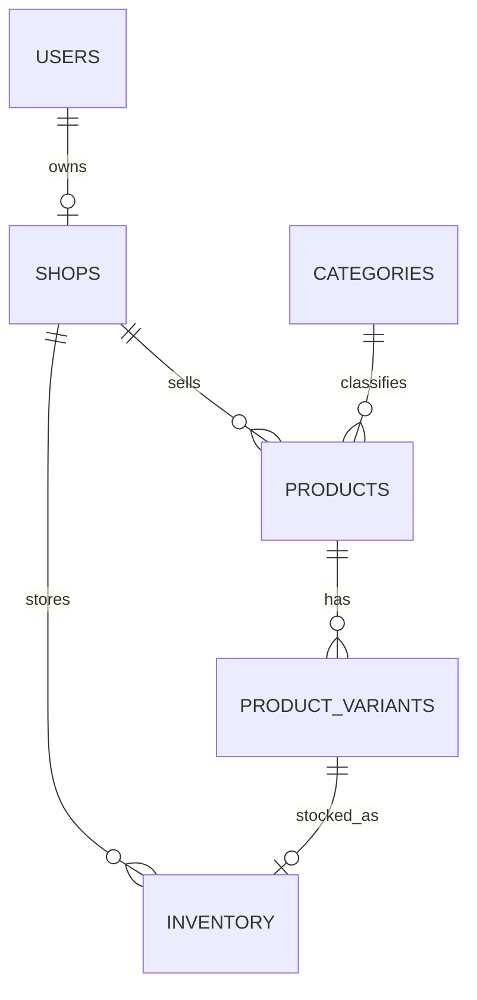

# Database

**Trạng thái:** In progress  
**Phạm vi đã triển khai:** Planning B1–B6

Tài liệu này mô tả schema vận hành đã được triển khai trong SQLAlchemy và Alembic. Đặc tả đầy đủ, bao gồm các bảng chưa triển khai, nằm trong [`PLANNING.md`](PLANNING.md#phần-b--database-từng-bảng-từng-cột).

## Quy ước chung

- PostgreSQL 16 được dùng trong môi trường development; Lakebase là đích triển khai và tương thích giao thức PostgreSQL.
- Khóa chính dùng `BIGINT` tự tăng; PostgreSQL tạo sequence tương ứng khi migration chạy.
- `created_at` và `updated_at` dùng `TIMESTAMPTZ` và lưu thời gian UTC.
- Tên constraint được chuẩn hóa để migration và lỗi database dễ truy vết.
- Quan hệ lịch sử không dùng cascade delete. Product sẽ được soft delete bằng `is_active` ở tầng nghiệp vụ.

## Quan hệ đã triển khai



## Bảng và constraint

### `users`

- Email là duy nhất và bắt buộc.
- Mật khẩu chỉ lưu ở cột `password_hash`; logic bcrypt sẽ được triển khai cùng authentication.
- Role chỉ nhận `BUYER`, `SHOP_OWNER` hoặc `ADMIN`.
- `is_active` mặc định là `true`.

### `shops`

- Mỗi shop có đúng một owner.
- `owner_id` là duy nhất nên một user chỉ sở hữu tối đa một shop.
- `is_active` mặc định là `true`.

### `categories`

- Category là danh sách phẳng.
- Tên category là duy nhất và bắt buộc.

### `products`

- Product thuộc một shop và một category.
- `base_price` dùng `NUMERIC(12,0)` và không được âm.
- `is_active` mặc định là `true`; thao tác xóa sau này phải là soft delete.

### `product_variants`

- Variant thuộc một product.
- Bộ `(product_id, size, color)` là duy nhất.
- SKU là duy nhất và bắt buộc; service tạo sản phẩm sẽ chịu trách nhiệm sinh SKU.
- `price` dùng `NUMERIC(12,0)`.

### `inventory`

- Mỗi variant có tối đa một dòng tồn kho.
- `shop_id` được lưu trực tiếp để truy vấn và phân quyền theo shop.
- `quantity` mặc định là `0` và có database check `quantity >= 0`.
- `low_stock_threshold` mặc định là `5`.

## Migration

Migration nền tảng: `20260916_0001_foundation_models.py`.

```powershell
docker compose --env-file .env.example exec -T backend alembic upgrade head
docker compose --env-file .env.example exec -T backend alembic current
```

## Phạm vi chưa triển khai

Các bảng B7–B14 vẫn ở trạng thái `Planned`: supplier, purchase order, cart, order, order status history, review và low-stock alert. Chúng sẽ được bổ sung bằng migration tiếp theo thay vì sửa migration đã áp dụng.
