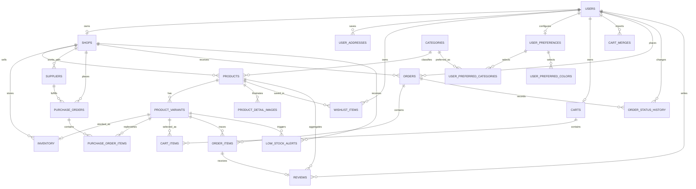

# Database

**Trạng thái:** Implemented
**Phạm vi đã triển khai:** Planning B1–B15, P1 hồ sơ/sổ địa chỉ, P2 wishlist và P3 sở thích mua sắm

Tài liệu này mô tả schema vận hành đã được triển khai trong SQLAlchemy và Alembic. Đặc tả đầy đủ, bao gồm các bảng chưa triển khai, nằm trong [`PLANNING.md`](PLANNING.md#phần-b--database-từng-bảng-từng-cột).

## Quy ước chung

- Lakebase tương thích giao thức PostgreSQL và schema SQLAlchemy hiện tại. `DATABASE_URL` chọn database ứng dụng; PostgreSQL 16 local phục vụ development/test. Hướng dẫn chuyển kết nối nằm ở [`DEPLOYMENT_GUIDE.md`](DEPLOYMENT_GUIDE.md#kết-nối-web-với-lakebase).
- Khóa chính dùng `BIGINT` tự tăng; PostgreSQL tạo sequence tương ứng khi migration chạy.
- `created_at` và `updated_at` dùng `TIMESTAMPTZ` và lưu thời gian UTC. Các bảng có luồng cập nhật mang cả hai timestamp; bảng snapshot và lịch sử chỉ cần `created_at`.
- Tên constraint được chuẩn hóa để migration và lỗi database dễ truy vết.
- Quan hệ lịch sử không dùng cascade delete. Product được soft delete bằng `is_active` ở tầng nghiệp vụ.

## Quan hệ đã triển khai


```mermaid
erDiagram
    USERS ||--o| SHOPS : owns
    USERS ||--o{ USER_ADDRESSES : saves
    USERS ||--o{ WISHLIST_ITEMS : owns
    USERS ||--o| USER_PREFERENCES : configures
    SHOPS ||--o{ PRODUCTS : sells
    CATEGORIES ||--o{ PRODUCTS : classifies
    USER_PREFERENCES ||--o{ USER_PREFERRED_CATEGORIES : selects
    CATEGORIES ||--o{ USER_PREFERRED_CATEGORIES : preferred_as
    USER_PREFERENCES ||--o{ USER_PREFERRED_COLORS : selects
    PRODUCTS ||--o{ PRODUCT_VARIANTS : has
    PRODUCTS ||--o{ PRODUCT_DETAIL_IMAGES : illustrates
    PRODUCTS ||--o{ WISHLIST_ITEMS : saved_in
    PRODUCT_VARIANTS ||--o| INVENTORY : stocked_as
    SHOPS ||--o{ INVENTORY : stores
    SHOPS ||--o{ SUPPLIERS : works_with
    SHOPS ||--o{ PURCHASE_ORDERS : places
    SUPPLIERS ||--o{ PURCHASE_ORDERS : fulfills
    PURCHASE_ORDERS ||--o{ PURCHASE_ORDER_ITEMS : contains
    PRODUCT_VARIANTS ||--o{ PURCHASE_ORDER_ITEMS : replenishes
    USERS ||--o| CARTS : owns
    USERS ||--o{ CART_MERGES : imports
    CARTS ||--o{ CART_ITEMS : contains
    PRODUCT_VARIANTS ||--o{ CART_ITEMS : selected_as
    USERS ||--o{ ORDERS : places
    SHOPS ||--o{ ORDERS : receives
    ORDERS ||--o{ ORDER_ITEMS : contains
    PRODUCT_VARIANTS ||--o{ ORDER_ITEMS : traces
    ORDERS ||--o{ ORDER_STATUS_HISTORY : records
    USERS ||--o{ ORDER_STATUS_HISTORY : changes
    ORDER_ITEMS ||--o| REVIEWS : receives
    PRODUCTS ||--o{ REVIEWS : aggregates
    USERS ||--o{ REVIEWS : writes
    PRODUCT_VARIANTS ||--o{ LOW_STOCK_ALERTS : triggers
    SHOPS ||--o{ LOW_STOCK_ALERTS : receives
```

## Bảng và constraint

### `users`

- Email là duy nhất và bắt buộc.
- Mật khẩu chỉ lưu ở cột `password_hash`; seed data và authentication dùng bcrypt.
- `email_verified_at` là `NULL` cho tài khoản mới và được set UTC sau khi xác minh; user có từ trước migration và user seed được đánh dấu đã xác minh.
- `auth_version` là số nguyên mặc định `0`, tăng sau mỗi lần reset mật khẩu để JWT cũ mất hiệu lực.
- `phone` và `avatar_url` là thông tin hồ sơ tùy chọn; avatar chỉ lưu URL, không lưu file.
- Role chỉ nhận `BUYER`, `SHOP_OWNER` hoặc `ADMIN`.
- `is_active` mặc định là `true`.

### `auth_tokens`

- Lưu token xác minh email và reset mật khẩu theo `purpose`; CHECK chỉ nhận `VERIFY_EMAIL`, `RESET_PASSWORD`.
- Chỉ lưu `token_hash` SHA-256 duy nhất, cùng `expires_at`, `used_at`; token gốc không được lưu.
- FK `user_id` dùng `ON DELETE CASCADE`; index `(user_id, purpose)` phục vụ thay thế token cũ.

### `user_addresses`

- Mỗi địa chỉ thuộc một user và bị xóa cascade khi user bị xóa; service chỉ cho role `BUYER` sử dụng.
- Lưu mã và snapshot tên của Tỉnh/Thành phố cùng Xã/Phường/Đặc khu; không có cột quận/huyện.
- `address_detail` giữ phần số nhà/đường/thôn/ấp/khu phố do buyer nhập. Receiver và số điện thoại là dữ liệu riêng của từng địa chỉ.
- Partial unique index `uq_user_addresses_default_user ON user_addresses (user_id) WHERE is_default` bảo đảm mỗi user có tối đa một địa chỉ mặc định. Service khóa dòng user khi đếm, tạo, đổi hoặc xóa địa chỉ.
- Order tiếp tục giữ snapshot độc lập trong `orders`; không đọc địa chỉ giao hàng lịch sử từ bảng này.

### `wishlist_items`

- Mỗi dòng nối một buyer với một product; `UNIQUE (buyer_id, product_id)` chặn lưu trùng ở database.
- Xóa user cascade toàn bộ wishlist. Product không cascade vì product chỉ được soft delete; item được giữ khi product hoặc shop bị ẩn.
- Có index riêng trên `buyer_id` và `product_id`. Bảng chỉ cần `created_at` vì item không có dữ liệu cần cập nhật.

### `user_preferences`, `user_preferred_categories`, `user_preferred_colors`

- `user_preferences.buyer_id` là unique và cascade theo user, bảo đảm mỗi buyer tối đa một cấu hình. `min_price`/`max_price` là `NUMERIC(12,0)` tùy chọn với CHECK không âm và CHECK thứ tự khoảng giá.
- `user_preferred_categories` nối preference với category; unique `(preference_id, category_id)`. Category không cascade vì là dữ liệu catalog dùng chung.
- `user_preferred_colors` lưu chuỗi màu tối đa 30 ký tự; unique `(preference_id, color)`. Màu không tách bảng master vì catalog hiện cũng lưu trực tiếp trên variant.
- Hai bảng con cascade khi preference bị xóa. Service thay thế cả hai danh sách cùng khoảng giá trong một transaction.

### `shops`

- Mỗi shop có đúng một owner.
- `owner_id` là duy nhất nên một user chỉ sở hữu tối đa một shop.
- `is_active` mặc định là `true`.

### `categories`

- Category là danh sách phẳng.
- Tên category là duy nhất và bắt buộc.

### `products`

- Product thuộc một shop và một category.
- `base_price` dùng `NUMERIC(12,0)` và không được âm.
- `is_active` mặc định là `true`; thao tác xóa sau này phải là soft delete.

Ảnh chính vẫn nằm ở `products.image_url` để giữ contract catalog và schema CDC hiện có. Bắt buộc ảnh chính cho tạo mới được kiểm tra ở API; migration không tạo ảnh giả cho product cũ thiếu ảnh.

### `product_detail_images`

- Migration `20261007_0011` thêm bảng riêng gồm `id`, `product_id`, `position`, `image_url`, `created_at` UTC. Không thêm cột vào `products`, nên nguồn CDC/Bronze/Silver hiện có giữ nguyên schema.
- FK trỏ product; UNIQUE `(product_id, position)` và CHECK `position BETWEEN 1 AND 10` bảo đảm tối đa 10 ảnh phụ mỗi product ở database.
- Vị trí quyết định thứ tự trả trong `detail_image_urls`. Service thay bộ ảnh trong cùng transaction với thông tin product và khóa dòng product để các lần sửa đồng thời không trộn ảnh.
- Product soft delete giữ ảnh và dữ liệu lịch sử. Upload file lưu riêng trên filesystem; xem [API ảnh](API.md#ảnh-sản-phẩm) và [storage](DEPLOYMENT_GUIDE.md#lưu-trữ-ảnh-sản-phẩm).
- Bảng ảnh không được thêm vào pipeline/Gold vì ảnh chi tiết không dùng cho metric hiện tại. Downgrade bỏ bảng và tham chiếu ảnh chi tiết, giữ product/ảnh chính và file vật lý.

### `product_variants`

- Variant thuộc một product.
- Bộ `(product_id, size, color)` là duy nhất.
- SKU là duy nhất, bắt buộc và có dạng `P{product_id}-{size}-{color}`; catalog service percent-encode dấu `%` và `-` trong size/color trước khi ghép để tránh va chạm giữa các cặp thuộc tính khác nhau.
- `price` dùng `NUMERIC(12,0)`.

### `inventory`

- Mỗi variant có tối đa một dòng tồn kho.
- `shop_id` được lưu trực tiếp để truy vấn và phân quyền theo shop.
- `quantity` mặc định là `0` và có database check `quantity >= 0`.
- `low_stock_threshold` mặc định là `5`.

### `suppliers`

- Supplier thuộc một shop và mặc định hoạt động.
- Số điện thoại và địa chỉ có thể để trống.

### `purchase_orders` và `purchase_order_items`

- Trạng thái phiếu nhập chỉ nhận `DRAFT`, `ORDERED`, `RECEIVED` hoặc `CANCELLED`; mặc định là `DRAFT`.
- Mỗi variant chỉ xuất hiện một lần trong một phiếu nhập.
- Số lượng nhập phải lớn hơn `0`.
- Việc chuyển `ORDERED → RECEIVED` và cộng kho một lần sẽ được bảo đảm bởi purchase service ở Planning C7.

### `carts` và `cart_items`

- Mỗi buyer có tối đa một giỏ hàng.
- Giỏ không lưu `shop_id`; shop được suy ra từ variant → product, cho phép chứa hàng nhiều shop.
- Mỗi variant chỉ xuất hiện một lần trong giỏ và số lượng phải lớn hơn `0`.

### `cart_merges`

- Ghi nhận import giỏ khách theo buyer, UUID `merge_id` và SHA-256 payload đã chuẩn hóa. UNIQUE (buyer_id, merge_id) bảo vệ retry; receipt và cart_items commit cùng transaction.
- Timestamp UTC có timezone; FK buyer có CASCADE. Receipt vẫn giữ sau checkout để retry cũ không thêm lại hàng đã mua.
- Migration `20261007_0010` bỏ carts.shop_id, giữ mọi item cũ và thêm receipt. Downgrade phục hồi shop cho giỏ rỗng/một shop; từ chối trước khi sửa schema nếu còn giỏ nhiều shop.

### `orders`, `order_items` và `order_status_history`

- Mã đơn là duy nhất.
- Trạng thái đơn, phương thức thanh toán và trạng thái thanh toán bị giới hạn theo Planning B10.
- `order_items` lưu snapshot tên sản phẩm, size, màu và đơn giá; số lượng phải lớn hơn `0`.
- Dòng lịch sử đầu tiên cho phép `from_status=NULL`; người thay đổi được liên kết với `users`.
- State machine và việc bắt buộc ghi lịch sử trong cùng transaction được bảo đảm bởi `order_service.transition_order()` theo Planning C5.

### `reviews`

- Mỗi order item chỉ được review một lần.
- Rating chỉ nhận giá trị từ `1` đến `5`.
- Product và buyer được lưu trực tiếp để phục vụ truy vấn và kiểm tra quyền.

### `low_stock_alerts`

- Alert liên kết trực tiếp với variant và shop; mặc định chưa được xử lý.
- ⚠️ Chỉ có tối đa một alert chưa xử lý (`is_resolved=false`) cho mỗi variant, enforce bằng partial unique index `uq_low_stock_alerts_open_variant ON low_stock_alerts (variant_id) WHERE NOT is_resolved` — chốt chặn cuối ở DB, không chỉ dựa vào kiểm tra "đã tồn tại chưa" ở `inventory_service.check_low_stock()` (kiểm tra ở service là đọc-rồi-ghi nên vẫn có thể thua race, index này là nơi thật sự chặn trùng).

## Migration

- Migration nền tảng: `20260916_0001_foundation_models.py`.
- Migration nghiệp vụ B7–B14: `20260922_0002_operational_models.py`.
- Migration timestamp cho các bảng có cập nhật: `20260922_0003_add_mutable_timestamps.py`.
- Migration ràng buộc một alert đang mở mỗi variant: `20260923_0004_low_stock_alert_unique_open.py`.
- Migration xác minh email và reset mật khẩu: `20260927_0005_add_email_auth_flows.py`.
- Migration hồ sơ và sổ địa chỉ: `20260927_0006_add_profiles_and_addresses.py`.
- Migration wishlist: `20260929_0007_add_wishlist_items.py`.
- Migration sở thích mua sắm: `20260929_0008_add_user_preferences.py`.

```powershell
docker compose --env-file .env.example exec -T backend alembic upgrade head
docker compose --env-file .env.example exec -T backend alembic current
```

## Seed data

`python -m app.seed` tạo dữ liệu demo idempotent theo Planning B15. Mật khẩu được hash bằng bcrypt; SKU theo đúng định dạng của B5; đơn hàng mới được rải trong 30 ngày tính từ ngày chạy. Chạy lại, kể cả vào ngày khác, không nhân đôi dữ liệu.

Các invariant cần transaction hoặc kiểm tra quyền đã được triển khai trong service tương ứng ở phần C; tài liệu chi tiết nằm trong [`BUSINESS_RULES.md`](BUSINESS_RULES.md).


## Lịch sử chatbot — nâng cấp được duyệt 06/10/2026

Migration `20261006_0009_add_chat_history.py` tạo:

- `chat_conversations`: FK user (cascade), FK shop nullable cho admin, role,
  title (120), remote_id, space_id, principal, host, timestamp UTC. Unique
  `(user_id, space_id, remote_id)`; index `(user_id, updated_at)`.
- `chat_messages`: FK conversation (cascade), remote_id, question và answer
  JSON gồm status/text/bảng giới hạn 100 dòng. Unique `(conversation_id,
  remote_id)` giúp polling không nhân đôi tin; index conversation.

Token hội thoại/JWT/OAuth không lưu ở hai bảng này. Tạo/sửa snapshot hội thoại
và tin nhắn cùng transaction, rollback khi lỗi. Không thêm chat vào CDC E1,
Silver, Gold hoặc nguồn Genie. Quyền đọc/tiếp tục/đổi tên/xóa ở
[Genie Chatbot](GENIE_CHATBOT.md). Chủ sở hữu migration Lakebase lần này là
OAuth user triển khai, có DDL và UPDATE alembic_version; `daln_app` được cấp
DML hai bảng và USAGE/SELECT/UPDATE hai sequence mới, không cấp DDL.
Alembic escape `%` khi đưa URL vào ConfigParser để username email/password
URL-encoded không gây lỗi interpolation; token OAuth không lưu thành URL cố định.
