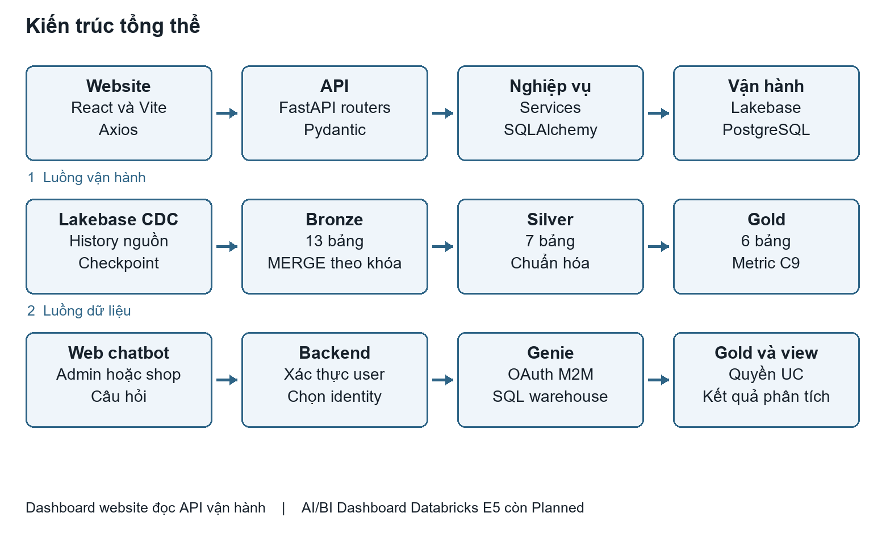
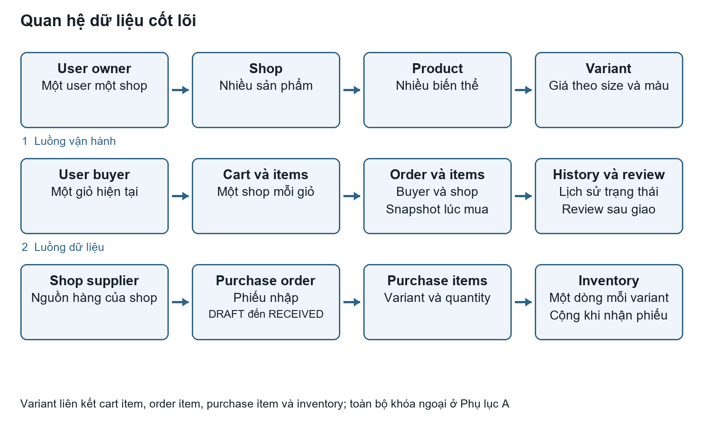
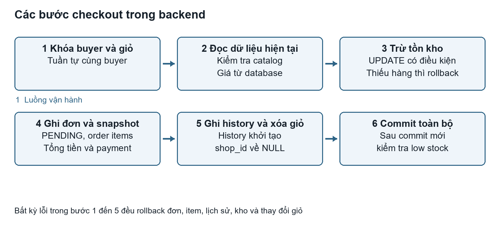
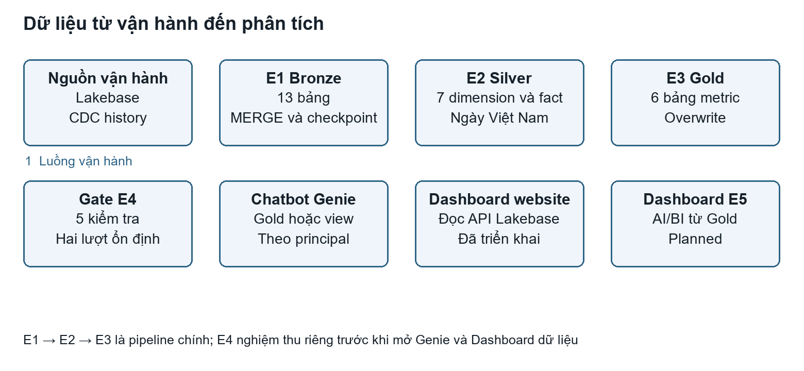
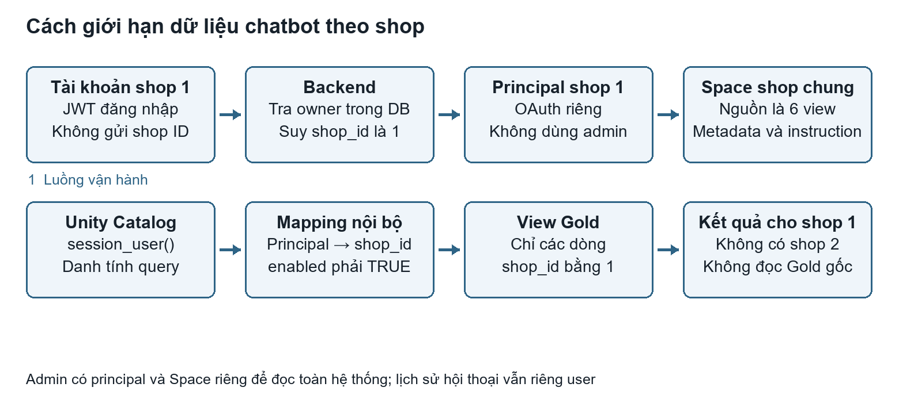

# Báo cáo toàn bộ hệ thống Fashion E Commerce

Nền tảng thương mại điện tử thời trang đa nhà bán hàng tích hợp phân tích dữ liệu và chatbot Databricks Genie

Ngày cập nhật: 10/10/2026. Baseline báo cáo: commit `5d8b5b1` ngày 06/10; gian hàng công khai đã có ở `fbf7805`. Trạng thái nghiệm thu E5/F7/G mới nhất nằm tại [E5 Dashboard](E5_DASHBOARD.md) và [Demo](DEMO.md). Các snapshot số liệu ngày 06/10 được giữ nguyên và ghi ngày. Phụ lục schema/API ban đầu được đối chiếu lại bằng các bổ sung cuối báo cáo.

Nhóm thực hiện: Nguyễn Trường Sơn, mã sinh viên 23010313; Nguyễn Ngọc Minh, mã sinh viên 23010623. Giảng viên hướng dẫn: Nguyễn Văn Sơn. Thông tin đề tài theo [PROPOSAL.md](PROPOSAL.md).

## Tóm tắt hệ thống

Fashion E-Commerce phục vụ ba nhóm người dùng: người mua, chủ shop và quản trị viên. Người mua tìm sản phẩm, chọn size và màu, đặt hàng, theo dõi đơn và đánh giá sau khi nhận hàng. Chủ shop quản lý catalog, đơn, nhà cung cấp, phiếu nhập, tồn kho và số liệu kinh doanh. Quản trị viên quản lý tài khoản, shop và hoạt động toàn nền tảng.

Hệ thống gồm website React, API FastAPI, database vận hành tương thích PostgreSQL trên Lakebase, pipeline Delta Lake theo mô hình Bronze–Silver–Gold và chatbot Genie đọc dữ liệu Gold. Giá trị kỹ thuật chính nằm ở việc bảo toàn nghiệp vụ khi có nhiều tài khoản và request đồng thời, giữ lịch sử đơn hàng, thống nhất metric và cưỡng chế quyền dữ liệu của chatbot theo từng shop.

Backend C0–C10, frontend D1–D4, các phần hồ sơ, wishlist, sở thích và gợi ý P1–P4 đã triển khai. Pipeline E1–E4 và chatbot admin/shop có bằng chứng nghiệm thu trong tài liệu dự án. Dashboard website đọc dữ liệu vận hành đã triển khai. AI/BI Dashboard E5 và demo production local đã có nghiệm thu ngày 10/10 theo các tài liệu chuyên trách; browser E2E Chromium trên API/Postgres demo đã PASS 5/5 ngày 10/10. Triển khai public vẫn Planned.

Báo cáo này tổng hợp hệ thống để học, thuyết trình và bàn giao. Đặc tả nghiệp vụ chuẩn nằm ở [PLANNING.md](PLANNING.md); API, schema và quy trình triển khai tiếp tục được duy trì tại các tài liệu chuyên trách. Số liệu nghiệm thu là snapshot có ngày, không phải số liệu trực tiếp tại thời điểm người đọc mở báo cáo.

## 1 Mục tiêu và phạm vi đề tài

### 1.1 Bài toán cần giải quyết

Một marketplace thời trang phải quản lý sản phẩm ở cấp biến thể. Một áo có thể có nhiều size và màu với giá, tồn kho khác nhau. Nếu chỉ lưu số lượng hoặc giá ở product, hệ thống có thể cho mua nhầm biến thể, hiển thị sai giá hoặc trừ sai kho. Trong mô hình nhiều shop, đơn hàng và nhập kho còn phải được tách theo chủ sở hữu.

Hoạt động vận hành tạo ra dữ liệu cần phân tích: đơn nào đã giao, doanh thu ghi nhận ngày nào, sản phẩm nào bán tốt và biến thể nào thiếu hàng. Đọc trực tiếp mọi bảng vận hành cho chatbot dễ dẫn tới metric không thống nhất. Vì vậy hệ thống xây dựng Gold có định nghĩa rõ và chỉ cho Genie truy cập các nguồn phù hợp với quyền người hỏi.

### 1.2 Mục tiêu triển khai

- Xây dựng website mua bán thời trang có đủ luồng khách, buyer, chủ shop và admin.
- Bảo vệ giá, tồn kho, quyền sở hữu, snapshot và lịch sử trạng thái đơn bằng backend và database.
- Tách dữ liệu vận hành khỏi dữ liệu phân tích; đồng bộ thay đổi bằng CDC và xử lý qua ba tầng Delta.
- Thống nhất doanh thu, số đơn, tỷ lệ hủy và AOV giữa API, Gold và Genie.
- Tích hợp chatbot trong website với dữ liệu riêng theo shop và lịch sử riêng theo tài khoản.
- Có migration, dữ liệu mẫu, kiểm thử và quy trình cài đặt đủ để chạy local/demo.

### 1.3 Ranh giới nghiệp vụ

Một user sở hữu tối đa một shop; mỗi shop quản lý một kho. Giỏ khách/buyer chứa hàng nhiều shop; mỗi checkout chọn đúng một shop và giữ hàng còn lại. Mỗi đơn thuộc đúng một shop. Thanh toán hỗ trợ COD và MOCK_CARD; MOCK_CARD là mô phỏng, không kết nối cổng thanh toán thật. Quy trình giao hàng là chuyển trạng thái trong hệ thống, không tích hợp đơn vị vận chuyển.

Danh mục là danh sách phẳng. Ảnh sản phẩm có upload local/gallery và URL; avatar lưu URL. Contract/storage ở [API](API.md) và [Deployment guide](DEPLOYMENT_GUIDE.md). Product, variant và supplier có cơ chế ẩn hoặc soft delete để giữ tham chiếu lịch sử. Các phần voucher, phí vận chuyển tự tính, đổi trả, lợi nhuận, dự báo nhu cầu, nhiều kho và recommender học máy không thuộc implementation hiện tại.

### 1.4 Trạng thái các phân hệ

| Phân hệ | Trạng thái | Phạm vi thực tế |
|---|---|---|
| Nền tảng và schema A–B | Implemented | Docker, PostgreSQL/Lakebase, model, migration, seed |
| Backend C0–C10 | Implemented | Auth, catalog, giỏ, checkout, đơn, kho, nhập hàng, review, thống kê, admin |
| Cá nhân hóa P1–P4 | Implemented | Hồ sơ, sổ địa chỉ, wishlist, sở thích, gợi ý theo điểm |
| Frontend D1–D4 | Implemented | Website và các trang quản lý theo role |
| Dashboard website | Implemented | API database vận hành, KPI, kỳ trước, biểu đồ, ưu tiên vận hành |
| Pipeline E1–E3 | Implemented | 13 Bronze, 7 Silver, 6 Gold |
| Gate chất lượng E4 | Implemented | 5/5 kiểm tra trên workspace theo bằng chứng nghiệm thu |
| Chatbot Genie | Implemented | Admin/shop, quyền theo danh tính, worker, lịch sử |
| AI/BI Dashboard E5 | Implemented | Artifact đã publish; nghiệm thu ở E5_DASHBOARD.md |
| E2E browser / F7 | Implemented | Browser local PASS 5/5; nghiệm thu tích hợp ở DEMO.md |
| Demo G / triển khai public | Implemented / Planned | Demo nginx/reset/CI đã có; public ngoài phạm vi demo |

Nguồn: [ARCHITECTURE.md](ARCHITECTURE.md), [USER_JOURNEY_REVIEW.md](USER_JOURNEY_REVIEW.md), [GENIE_CHATBOT.md](GENIE_CHATBOT.md).

## 2 Tác nhân và chức năng sử dụng

### 2.1 Khách chưa đăng nhập

Khách xem catalog và chi tiết sản phẩm qua API public, tìm theo tên và lọc theo danh mục, shop, giá hoặc sắp xếp. Khách đăng ký buyer hoặc chủ shop, xác minh email, đăng nhập và dùng luồng quên mật khẩu. Khách có giỏ tạm trên trình duyệt và merge khi đăng nhập; checkout, wishlist, đơn riêng và chatbot yêu cầu role phù hợp.

### 2.2 Người mua

Buyer lưu hồ sơ và tối đa 10 địa chỉ; chọn một địa chỉ mặc định. Buyer lưu sản phẩm yêu thích, thiết lập danh mục, màu và khoảng giá mong muốn. Catalog có mục Dành cho bạn xếp sản phẩm còn hàng theo mức khớp sở thích.

Khi mua, buyer chọn đúng variant, thêm vào giỏ, kiểm tra giá và số lượng, gửi thông tin người nhận rồi checkout. Sau đó buyer theo dõi trạng thái, đọc snapshot đơn, hủy khi còn PENDING hoặc đánh giá từng item sau DELIVERED. Buyer không được quản lý dữ liệu shop hoặc dùng chatbot phân tích admin/shop.

### 2.3 Chủ shop

Tài khoản SHOP_OWNER chưa có shop được giao diện hướng dẫn tạo shop. Sau đó shop quản lý sản phẩm, thêm hoặc sửa variant, giá và trạng thái hoạt động. Shop không sửa trực tiếp số lượng tồn kho trong trang inventory; kho thay đổi qua checkout, hoàn kho do hủy đơn hoặc nhận phiếu nhập.

Shop tiếp nhận đơn thuộc mình, đọc người nhận và hàng cần giao, chuyển trạng thái theo quy trình, theo dõi cảnh báo, tạo nhà cung cấp và phiếu nhập. Dashboard và chatbot của shop chỉ phân tích phạm vi shop của tài khoản hiện tại.

### 2.4 Quản trị viên

Admin xem, tìm và khóa/mở tài khoản hoặc shop; xem đơn và thống kê toàn hệ thống. Hệ thống chặn admin tự khóa tài khoản đang dùng. Khóa shop ẩn hàng của shop khỏi catalog public nhưng không xóa đơn và doanh thu lịch sử.

Admin có chatbot đọc toàn bộ sáu bảng Gold. Phạm vi dữ liệu kinh doanh toàn hệ thống không cấp quyền đọc lịch sử chat của người khác: lịch sử vẫn thuộc riêng từng user.

### 2.5 Ma trận quyền tổng quát

| Chức năng | Khách | BUYER | SHOP_OWNER | ADMIN |
|---|---|---|---|---|
| API catalog public | Có | Có | Có | Có |
| Hồ sơ tài khoản hiện tại | Không | Có | Có | Có |
| Địa chỉ, wishlist, sở thích, gợi ý | Không | Của mình | Không | Không |
| Giỏ và checkout | Không | Của mình | Không | Không |
| Chi tiết đơn | Không | Đơn của mình | Đơn shop mình | Mọi đơn |
| Chuyển trạng thái đơn của shop | Không | Không | Shop mình | Không trong contract C5 |
| Kho, supplier, phiếu nhập | Không | Không | Shop mình | Không trong API shop |
| Quản lý tài khoản và shop | Không | Không | Không | Có |
| Thống kê và chatbot | Không | Không | Shop mình | Toàn hệ thống |
| Lịch sử chatbot | Không | Không | Chat của mình | Chat của mình |

API catalog public và điều hướng UI là hai lớp khác nhau. App hiện điều hướng user đăng nhập về khu vực đúng role; việc API public có thể đọc được không có nghĩa giao diện chủ shop hiển thị đầy đủ luồng buyer.

## 3 Kiến trúc hệ thống và công nghệ

### 3.1 Kiến trúc tổng thể

Website gửi HTTP request qua Axios tới FastAPI. Router xác thực request và gọi service. Service kiểm tra nghiệp vụ, quyền và transaction; SQLAlchemy làm việc với database. Alembic quản lý các thay đổi schema.

Database vận hành cấp dữ liệu cho website và API dashboard. Luồng phân tích đọc thay đổi Lakebase vào các bảng history CDC, đồng bộ Bronze, làm sạch Silver rồi tổng hợp Gold. Chatbot gọi Genie bằng danh tính server lựa chọn; Genie truy vấn Gold hoặc view Gold đã lọc theo danh tính.



Hình 1. Hai đường đọc chính: API vận hành từ Lakebase và chatbot phân tích từ Gold. Trạng thái artifact và nghiệm thu AI/BI Dashboard ở [E5 Dashboard](E5_DASHBOARD.md).

### 3.2 Công nghệ đang sử dụng

| Lớp | Công nghệ | Trách nhiệm |
|---|---|---|
| Giao diện | React, Vite, React Router | Trang, layout theo role, routing và trạng thái UI |
| HTTP client | Axios | URL API chung, Bearer token, xử lý phiên |
| API | FastAPI, Pydantic | Contract, validation, OpenAPI và dependency |
| Dữ liệu vận hành | SQLAlchemy 2, psycopg, PostgreSQL 16, Lakebase | ORM, SQL, transaction và constraint |
| Schema | Alembic | Migration có version |
| Xác thực | bcrypt, PyJWT, SMTP | Hash mật khẩu, JWT, xác minh và reset email |
| Phân tích | Spark, Delta Lake, Unity Catalog | CDC/MERGE, biến đổi, Gold và quyền dữ liệu |
| Điều phối | Databricks Job, serverless, SQL warehouse | Pipeline, metadata preflight, query Gold |
| Chatbot | Databricks Genie, OAuth M2M | Câu hỏi ngôn ngữ tự nhiên trên dữ liệu được cấp quyền |
| Môi trường | Docker Compose | App local, database test và worker Genie |
| Kiểm thử | pytest, Vitest, jsdom, Ruff, ESLint, Prettier | Nghiệp vụ, UI, dữ liệu và chất lượng code |

Phiên bản và khoảng phiên bản dependency được quản lý trong `backend/requirements.txt`, `frontend/package.json`, lockfile frontend và các file requirements của `data/`. Báo cáo không suy ra runtime chính xác từ một khoảng phiên bản.

### 3.3 Tổ chức code

`backend/app/routers/` chứa endpoint; `schemas/` chứa request/response; `services/` chứa nghiệp vụ; `models/` chứa cấu trúc bảng; `tests/` chứa kiểm thử backend. Cấu trúc này giúp tránh logic kiểm tra kho, tính tiền hoặc quyền sở hữu bị sao chép giữa endpoint.

Frontend tách `api/`, `auth/`, `components/` và `pages/`. Trang shop/admin nằm trong nhóm riêng; layout và một số component như dashboard, snapshot đơn, dialog chi tiết, bảng và chatbot được dùng chung. Pipeline có các notebook entry mỏng và module query, điều phối, metadata, checkpoint, quality và acceptance riêng.

### 3.4 Hai nguồn đọc số liệu

Dashboard website đọc database vận hành qua FastAPI nên phản ánh dữ liệu hiện có lúc query. Chatbot đọc Gold nên phản ánh lần pipeline hoàn tất gần nhất. Khi một đơn vừa giao nhưng Job chưa chạy, số dashboard website và chatbot có thể khác nhau tạm thời; cần đối chiếu cùng cửa sổ dữ liệu trước khi kết luận metric sai.

Pipeline chưa có cam kết realtime. Mô hình thiết kế hỗ trợ chạy tay trước demo hoặc lịch Job; lịch thực sự phải kiểm tra trong cấu hình workspace, không suy ra chỉ từ Planning.

## 4 Thiết kế dữ liệu vận hành

### 4.1 Nguyên tắc lưu trữ

Khóa chính dùng BIGINT tự tăng. Timestamp nghiệp vụ dùng UTC có timezone. Tiền được lưu bằng kiểu NUMERIC/DECIMAL thay vì float. Quan hệ lịch sử không xóa theo product; các đối tượng thương mại được ẩn bằng `is_active` để đơn cũ vẫn truy vết được.

Constraint bảo vệ các điều kiện có thể kiểm tra ngay ở database: email và SKU duy nhất, variant không trùng size/màu trong product, số lượng kho không âm, số lượng item dương, review 1–5 và unique các liên kết cần thiết. Các invariant liên quan nhiều bảng, quyền hoặc trạng thái do service bảo vệ trong transaction.

### 4.2 Các nhóm bảng

| Nhóm | Bảng | Vai trò |
|---|---|---|
| Tài khoản | users, auth_tokens | Danh tính, role, khóa tài khoản, token xác minh/reset |
| Hồ sơ buyer | user_addresses | Địa chỉ nhận hàng hai cấp và mặc định |
| Cá nhân hóa | wishlist_items, user_preferences, user_preferred_categories, user_preferred_colors | Sản phẩm lưu và sở thích |
| Catalog | shops, categories, products, product_variants | Shop, nhóm hàng, sản phẩm và biến thể |
| Kho | inventory, low_stock_alerts | Số lượng theo variant và cảnh báo |
| Nhập hàng | suppliers, purchase_orders, purchase_order_items | Nguồn hàng, phiếu và chi tiết |
| Mua hàng | carts, cart_items | Giỏ hiện tại của buyer |
| Đơn hàng | orders, order_items, order_status_history | Đơn, snapshot item và lịch sử |
| Đánh giá | reviews | Review gắn item đã giao |
| Chatbot | chat_conversations, chat_messages | Hội thoại và snapshot kết quả riêng user |

Schema vận hành hiện có 26 bảng (không tính alembic_version); hai bảng bổ sung là cart_merges và product_detail_images. Pipeline E1 chỉ lấy 13 bảng trong allow-list; không có quy tắc sao chép mọi bảng vận hành sang Gold.

### 4.3 Quan hệ chính



Hình 2. Quan hệ cốt lõi của catalog, giỏ, đơn và nhập kho. Phụ lục A liệt kê đủ các cột và khóa ngoại của toàn bộ schema, bao gồm các bảng cá nhân hóa và chat.

Một user có thể sở hữu một shop và một giỏ. Shop có nhiều product; mỗi product có nhiều variant và mỗi variant có một dòng inventory. Orders thuộc buyer và shop; order_items tham chiếu variant nhưng đồng thời lưu tên, size, màu, giá lúc mua. Purchase order thuộc shop và supplier, chứa các variant cùng shop.

### 4.4 Snapshot và dữ liệu hiện tại

Giỏ hàng đọc giá, tên và tồn kho hiện tại; giỏ không giữ giá cam kết. Checkout lấy lại dữ liệu từ database và tạo snapshot trong order_items. Nếu shop đổi tên áo hoặc giá sau khi đặt, đơn cũ vẫn giữ thông tin lúc mua.

Địa chỉ đơn cũng là snapshot trong orders. Buyer sửa hoặc xóa địa chỉ đã lưu không làm đổi nơi nhận của đơn cũ. Rating catalog và giá wishlist được tính theo dữ liệu hiện tại, không phải snapshot lúc lưu yêu thích.

### 4.5 Các ràng buộc quan trọng

- `shops.owner_id` unique giới hạn một shop mỗi user.
- `(product_id, size, color)` unique giới hạn một variant cho một bộ thuộc tính.
- `inventory.variant_id` unique và `quantity >= 0` bảo vệ kho theo variant.
- Một buyer có tối đa một cart; `(cart_id, variant_id)` unique.
- `reviews.order_item_id` unique ngăn review hai lần cho cùng item.
- Partial unique index chỉ cho một alert chưa giải quyết trên mỗi variant.
- Partial unique index chỉ cho một địa chỉ mặc định trên mỗi user.
- Các cặp buyer/product, preference/category, preference/color và conversation/remote message không trùng.

`cart.shop_id = NULL` khi rỗng, quyền chéo shop và transition hợp lệ không thể chỉ dựa vào các unique/check đơn giản; service và test chịu trách nhiệm bảo vệ.

### 4.6 Migration và seed

Schema đã phát triển qua các migration 0001–0009: nền tảng, nghiệp vụ, timestamp, alert unique, email auth, hồ sơ/địa chỉ, wishlist, sở thích và lịch sử chatbot. Migration mới nhất là `20261006_0009_add_chat_history.py`.

Seed là idempotent: chạy lại không nhân bản bộ dữ liệu mẫu. Bộ seed mô tả trong hướng dẫn có 3 shop, 45 product, 135 variant, 6 supplier và 36 order. Đây là dữ liệu demo; số record thực tế có thể tăng khi người dùng thao tác. Tài khoản mẫu và hướng dẫn seed nằm ở [DEPLOYMENT_GUIDE.md](DEPLOYMENT_GUIDE.md), không cần sao chép mật khẩu vào báo cáo.

## 5 Backend và hợp đồng API

### 5.1 Vòng đời request

Một request xác thực mang `Authorization: Bearer <token>`. Backend decode JWT, tải user từ database, kiểm tra phiên và trạng thái tài khoản. Dependency role áp dụng cho router; các thao tác thuộc shop lấy shop qua `shops.owner_id` của user trong database.

Router nhận Pydantic schema, gọi service và trả schema response. Service kiểm tra tài nguyên, quyền sở hữu và nghiệp vụ. Nếu thao tác ghi nhiều bảng, service commit một lần sau toàn bộ thay đổi; khi có lỗi rollback toàn bộ.

### 5.2 Nhóm API

| Nhóm | Ví dụ endpoint | Phạm vi |
|---|---|---|
| Hệ thống và auth | /health, /auth/login, /auth/register | Health, token, email và reset |
| Hồ sơ và địa chỉ | /users/me/profile, /users/me/addresses | User hiện tại, địa chỉ buyer |
| Catalog | /products, /products/{id}, /categories | Đọc public, quản lý theo owner |
| Cá nhân hóa | /wishlist, /users/me/preferences, /users/me/recommendations | Buyer hiện tại |
| Cart và checkout | /cart, /cart/items, /orders/checkout | Giỏ và đặt hàng |
| Đơn | /orders/my, /orders/{id}, /shop/orders | Quyền theo buyer/shop/admin |
| Kho | /shop/inventory, /shop/alerts | Variant của shop hiện tại |
| Nhập hàng | /shop/suppliers, /shop/purchase-orders | Nguồn và nhận kho |
| Review | /reviews, /products/{id}/reviews | Buyer đã nhận hàng và đọc public |
| Dashboard và thống kê | /shop/stats/dashboard, /admin/stats/dashboard | Shop hoặc toàn hệ thống |
| Admin | /admin/users, /admin/shops, /admin/orders | ADMIN |
| Chatbot | /analytics/chat/messages, /analytics/chat/conversations | ADMIN/SHOP_OWNER và lịch sử riêng |

Đây là bảng nhóm chức năng. Phụ lục B liệt kê toàn bộ method/path lấy từ OpenAPI của code hiện tại; payload, quyền và ví dụ chuẩn nằm ở [API.md](API.md).

### 5.3 Validation và lỗi

| HTTP | Ý nghĩa thông dụng | Ví dụ |
|---|---|---|
| 400 | Vi phạm nghiệp vụ | Giỏ rỗng, transition sai, review trước giao |
| 401 | Thiếu hoặc sai xác thực | JWT sai hoặc hết hạn |
| 403 | Không có quyền | Buyer gọi API shop, shop đọc đơn shop khác |
| 404 | Không tồn tại hoặc không còn public | ID không có, catalog đã ẩn |
| 409 | Xung đột | Không đủ kho, giỏ khác shop, variant trùng |
| 422 | Request không hợp lệ | Số lượng âm, rating ngoài 1–5, payload giả scope |
| 429 | Quá tải hoặc rate limit | Auth/chat gửi quá nhiều |
| 502 | Lỗi kết nối/kết quả Genie | Query remote không đọc được |
| 503 | Chưa có cấu hình hoặc dịch vụ chưa sẵn sàng | Identity shop chưa cấp, SMTP lỗi |

Lỗi nghiệp vụ thường trả trường `detail`. Validation FastAPI có thể trả danh sách lỗi. Lỗi giỏ khác shop có contract riêng kèm `current_shop`; frontend dựa vào mã `CART_DIFFERENT_SHOP` để hỏi buyer có muốn thay giỏ không.

### 5.4 Bảo vệ contract

Endpoint shop không lấy phạm vi từ `shop_id` client hoặc chỉ tin claim JWT. Các schema từ chối nhiều trường ngoài contract. Checkout không nhận giá đáng tin cậy từ client; ngay cả trường total_amount được bỏ qua ở contract hiện tại, tổng cuối vẫn tính từ database.

Admin và API public có thể có query shop_id để lọc theo chức năng đã định nghĩa. Điều này khác với cho shop owner lựa chọn tùy ý shop trong API quản trị của mình.

## 6 Xác thực và phân quyền

### 6.1 Đăng ký và xác minh email

Người dùng đăng ký BUYER hoặc SHOP_OWNER. Tài khoản mới chưa thể login trước khi xác minh email. Backend tạo token ngẫu nhiên, chỉ lưu SHA-256 token cùng purpose và hạn dùng; liên kết email mang token gốc. Token xác minh mặc định có hạn 8 giờ và được dùng một lần.

Email/role/trạng thái tài khoản không thuộc các trường sửa hồ sơ thông thường. Tự đăng ký ADMIN bị từ chối. Một shop được tạo bởi tài khoản owner chưa có shop, không có luồng duyệt shop trong scope.

### 6.2 Đăng nhập và vô hiệu hóa phiên

Mật khẩu lưu bcrypt hash. JWT chứa định danh user, role, shop_id, auth_version và expiry. Backend tải user từ database để lấy role và trạng thái thực tế. Sau reset mật khẩu, auth_version tăng; token cũ không còn khớp và bị từ chối.

Tài khoản bị admin khóa không đăng nhập được và request xác thực tiếp theo bị chặn. Reset token mặc định có hạn 30 phút; reset thành công không tự đăng nhập. Forgot/resend trả thông tin chung để tránh lộ email có đăng ký hay không.

### 6.3 Phân quyền theo tài nguyên

Role trả lời câu hỏi user có được dùng nhóm chức năng hay không. Ownership trả lời tài nguyên đó có thuộc user hoặc shop hiện tại hay không. Shop A mang role đúng vẫn nhận 403 khi sửa product hoặc đọc đơn thuộc shop B.

Backend tái dùng dependency `get_current_user`, `require_role` và `get_current_shop`. Service áp dụng owner filter hoặc kiểm tra quan hệ variant → product → shop. Frontend `RequireRole` hỗ trợ trải nghiệm và điều hướng, không thay kiểm tra quyền server.

### 6.4 Phạm vi an toàn hiện tại

JWT trong frontend hiện lưu localStorage. Rate limiter auth dùng bộ nhớ trong một instance. Secret SMTP, JWT, database và OAuth thuộc cấu hình ngoài Git. Đây là thiết kế đang có cho local/demo, chưa là bằng chứng đã hoàn thiện mọi yêu cầu production.

Quy trình triển khai tách role runtime database khỏi danh tính migration. Role runtime Lakebase `daln_app` có DML cần thiết, không có quyền quản lý database/role hoặc DDL tổng quát theo nghiệm thu đã ghi nhận. Credential worker cấp quyền Genie tách khỏi credential chỉ đọc mà backend chatbot sử dụng.

## 7 Catalog và cá nhân hóa người mua

### 7.1 Sản phẩm và biến thể

Product có shop, category, tên, mô tả, ảnh, base_price và is_active. Variant có size, color, SKU, price và is_active. Giá mua thực tế là `variant.price`; `base_price` không thay thế giá biến thể khi checkout.

Tạo product tạo kèm variants và inventory trong một transaction. Một variant lỗi có thể làm rollback toàn bộ product. SKU được sinh theo product/size/color và encode các ký tự có thể làm va chạm; database vẫn bảo vệ unique.

Catalog public chỉ trả product hoạt động thuộc shop hoạt động. Trang quản lý shop đọc cả product/variant đã ẩn để chủ shop có thể chỉnh lại sau reload. Chi tiết hiển thị giá và tồn kho theo lựa chọn size/màu cụ thể.

### 7.2 Hồ sơ và sổ địa chỉ

Mọi user đăng nhập sửa họ tên, điện thoại, avatar URL. Buyer có sổ địa chỉ dùng bộ địa danh Việt Nam hai cấp đóng gói trong backend, không gọi dịch vụ ngoài lúc runtime. User chọn Tỉnh/Thành phố và Xã/Phường/Đặc khu bằng mã hợp lệ; backend kiểm tra quan hệ và lưu snapshot tên.

Địa chỉ đầu tiên tự là mặc định. Xóa mặc định chọn địa chỉ còn lại sớm nhất. Service khóa user khi đếm và đổi mặc định, kết hợp partial unique index để bảo vệ đồng thời. Checkout có thể tự điền từ sổ địa chỉ nhưng vẫn gửi dữ liệu người nhận và địa chỉ theo contract snapshot.

### 7.3 Wishlist

Wishlist lưu theo product, không chọn trước variant. Thêm/xóa là idempotent và unique buyer/product ngăn nhân đôi. Khi product/shop bị ẩn, item đã lưu vẫn được trả nhưng đánh dấu không khả dụng; buyer vẫn xóa được.

Giá từ, rating và tình trạng hàng trong wishlist đọc lại từ catalog. Mua từ wishlist đưa buyer sang chi tiết để chọn variant, tiếp tục áp dụng quy tắc giỏ và tồn kho chung.

### 7.4 Sở thích và gợi ý

P3 lưu danh mục, màu và khoảng giá. PUT thay thế toàn bộ cấu hình trong một transaction. Màu phải có trong catalog hoạt động hoặc là màu cũ buyer đã lưu; không thu thập size, số đo hay giới tính ngoài mô hình hiện có.

P4 là thuật toán chấm điểm theo luật, không phải mô hình học máy. Khớp danh mục được một điểm; có variant còn hàng khớp màu được một điểm; có variant còn hàng trong khoảng giá được một điểm. Màu và giá xét độc lập, không bắt buộc cùng variant. Nhiều variant khớp không nhân điểm.

Sản phẩm phải hoạt động, shop hoạt động và có variant hoạt động còn hàng. Kết quả xếp điểm giảm dần, ngày tạo giảm dần, ID giảm dần rồi mới giới hạn; mặc định 8, tối đa 20. Không có hoặc không khớp sở thích thì dùng sản phẩm mới còn hàng. Endpoint không lưu/cache điểm và không suy sở thích từ wishlist hoặc lịch sử đơn.

## 8 Giỏ hàng checkout và trạng thái đơn

### 8.1 Giỏ nhiều shop, checkout một shop

Cart thuộc buyer, không có shop_id. Cart item tham chiếu variant và được nhóm theo shop từ catalog. Thêm cùng variant cộng số lượng; hàng khác shop cùng tồn tại. Khách lưu variant/quantity và merge_id trên trình duyệt; giá/kho được preview từ API public. Merge khi đăng nhập có transaction và receipt cart_merges để retry không cộng trùng.

Giỏ không giữ hàng; thêm vào giỏ không trừ kho. Checkout chọn một shop, lấy lại dữ liệu hiện tại từ database và chỉ xóa các item của shop đó sau thành công. Contract/test chuẩn tại [API](API.md), [Business rules](BUSINESS_RULES.md) và [Testing](TESTING.md).

### 8.2 Transaction checkout



Hình 3. Checkout kiểm tra dữ liệu hiện tại và ghi toàn bộ đơn trong một transaction. Cảnh báo tồn kho là bước sau commit.

Checkout khóa user/buyer và cart để hai request trên cùng giỏ không tạo hai đơn. Backend lấy lại item và khóa đọc chia sẻ trên catalog liên quan, bảo đảm trạng thái variant, product và shop hợp lệ trong lúc đặt. Giá lấy từ database hiện tại.

Tồn kho được trừ bằng UPDATE có điều kiện số lượng còn đủ. Nếu số dòng cập nhật bằng 0, backend trả lỗi thiếu hàng. Cách này tránh hai buyer cùng đọc quantity=1 rồi cùng đặt thành công. Constraint quantity không âm là lớp bảo vệ bổ sung.

Trong cùng transaction, backend tạo order PENDING, snapshot order_items, tổng tiền, history đầu tiên và trạng thái thanh toán; xóa cart_items thuộc shop được chọn và giữ hàng shop khác. Một item thiếu hàng hoặc lỗi ghi làm rollback toàn bộ, kể cả kho của item đã xử lý trước đó.

### 8.3 Ví dụ kiểm soát giá và rollback

Buyer thêm hai áo vào giỏ khi variant có giá 200.000 VND. Nếu trước checkout shop đổi thành 210.000 VND, backend dùng giá hiện tại và tổng thành 420.000 VND. Sau khi tạo đơn, việc đổi giá lần nữa không sửa snapshot 210.000 VND của đơn.

Nếu giỏ có áo và quần nhưng quần thiếu kho, toàn bộ checkout thất bại; không để lại đơn nửa chừng, không mất kho áo và không xóa giỏ. Nếu hai request cùng checkout một giỏ, khóa buyer/cart cho request thứ hai thấy nhóm shop đã checkout không còn item sau request thứ nhất thành công.

### 8.4 State machine đơn hàng

Đường giao thông thường là PENDING → CONFIRMED → PREPARING → SHIPPING → DELIVERED. Buyer chỉ hủy đơn của mình khi PENDING. Shop có thể hủy khi PENDING hoặc CONFIRMED. CANCELLED và DELIVERED là trạng thái cuối trong contract hiện tại.

Mọi transition đi qua `order_service.transition_order()`, khóa order bằng FOR UPDATE rồi kiểm tra actor và trạng thái. Update order, side effect kho/thanh toán và ghi history cùng transaction. Transition sai trả 400; sai ownership trả 403; ID không có trả 404.

### 8.5 Thanh toán và hoàn kho

MOCK_CARD được đánh dấu PAID ngay khi checkout; COD bắt đầu UNPAID và thành PAID khi DELIVERED. Hệ thống không có thanh toán ngân hàng hoặc webhook cổng thanh toán thật.

Hủy đơn hoàn kho từng item đúng một lần và ghi cancelled_at/cancel_reason. Gọi hủy lại không hoàn thêm kho; idempotency ở đây nghĩa bảo vệ side effect, không cam kết mỗi lần gọi trả cùng mã HTTP. Khi buyer hủy và shop xác nhận đồng thời, khóa dòng đơn bảo đảm chỉ một transition hợp lệ từ trạng thái ban đầu.

### 8.6 Đánh giá sau khi giao

Buyer gửi order_item_id, rating 1–5 và comment. Backend kiểm tra item tồn tại, đơn thuộc buyer, trạng thái DELIVERED và chưa có review. Product ID được suy từ variant trong database. Rating trung bình tính trực tiếp từ review và thống nhất giữa trang catalog, chi tiết và endpoint review.

## 9 Tồn kho cảnh báo và nhập hàng

### 9.1 Inventory theo variant

Inventory có variant_id, shop_id, quantity và low_stock_threshold. Trang inventory trả tên product, size, màu, SKU, số lượng, ngưỡng và is_low. `is_low = quantity < threshold`, nên bằng ngưỡng không bị coi là thấp. Chủ shop chỉ sửa ngưỡng không âm; số lượng thay đổi qua các nghiệp vụ có kiểm soát.

### 9.2 Cảnh báo tồn kho thấp

Sau checkout trừ kho, service kiểm tra cảnh báo. Chỉ một alert chưa giải quyết được tồn tại cho mỗi variant. Sau hoàn kho hoặc nhận phiếu, alert được giải quyết khi quantity từ threshold trở lên.

Cảnh báo được tạo/giải quyết sau commit giao dịch chính, trong transaction riêng có khóa inventory. Lỗi cảnh báo không rollback đơn đã đặt hay nhận kho đã thành công. Điều này bảo vệ nghiệp vụ chính nhưng cũng có nghĩa alert không có cùng tính nguyên tử với đơn/kho; cần nhận diện giới hạn khi vận hành.

### 9.3 Supplier và phiếu nhập

Supplier thuộc shop, có tên, số điện thoại, địa chỉ và is_active. Xóa supplier là soft delete; phiếu cũ vẫn giữ tham chiếu. Tạo phiếu mới chỉ chọn supplier hoạt động của shop và các variant thuộc shop đó.

Phiếu khởi tạo DRAFT, đi DRAFT → ORDERED → RECEIVED. DRAFT hoặc ORDERED có thể chuyển CANCELLED. Chỉ ORDERED → RECEIVED mới cộng quantity vào kho và đặt received_at. RECEIVED là trạng thái cuối nên request lặp lại không cộng kho lần hai.

Service khóa phiếu, xác minh transition và cập nhật toàn bộ item trong một transaction. Request item không rỗng, số lượng dương và không trùng variant. Nhận phiếu có lỗi không để một số variant được cộng còn số khác chưa cộng.

### 9.4 Quyền và lỗi nhập hàng

Supplier, variant hoặc phiếu không tồn tại trả 404; tồn tại nhưng thuộc shop khác trả 403. Supplier đã ẩn không được tạo phiếu mới và trả lỗi nghiệp vụ. Unit cost là chi phí nhập được shop cung cấp theo contract; chưa có metric lợi nhuận hoặc công thức giá vốn trong Gold.

## 10 Frontend và trải nghiệm người dùng

### 10.1 Điều hướng và client chung

AuthProvider giữ session và điều hướng BUYER về catalog, SHOP_OWNER về `/shop/dashboard`, ADMIN về `/admin/dashboard`. RequireRole/RequireAuth bọc route phù hợp. Axios client chung gắn token, dùng một cấu hình URL và xử lý lỗi phiên; lỗi sai mật khẩu ở form login vẫn được hiển thị tại form.

### 10.2 Các nhóm màn hình

| Nhóm | Màn hình chính | Mục đích |
|---|---|---|
| Khách và auth | Catalog, chi tiết, login, register, xác minh, forgot/reset | Khám phá hàng và tạo phiên |
| Buyer | Cart, checkout, orders, order detail, wishlist, preferences, profile | Mua và quản lý dữ liệu cá nhân |
| Shop | Dashboard, products/variants, orders, inventory, alerts, suppliers, purchase orders, chatbot | Vận hành shop |
| Admin | Dashboard, users, shops, orders, chatbot | Quản trị nền tảng |

### 10.3 Trạng thái và thao tác

Trang có loading, empty, error và retry phù hợp. Giá định dạng VND; chi tiết product hiển thị đúng giá/kho variant. Lỗi thao tác giữ dữ liệu đã tải để người dùng sửa hoặc thử lại; lỗi tải không trình bày dữ liệu cũ như dữ liệu mới.

Cart chặn checkout khi còn bản nháp số lượng chưa lưu, request đang ghi hoặc thiếu kho. Form hồ sơ và checkout chặn submit trùng. Request trả chậm sau đổi route hoặc kỳ dashboard bị bỏ qua để tránh ghi kết quả cũ lên màn hình mới.

Buyer và shop/admin dùng snapshot đơn chung để xem đúng tên, size, màu, giá và người nhận. Shop/admin mở dialog chi tiết từ bảng đơn. Thông tin ngày giờ đơn hiển thị theo giờ Việt Nam; trạng thái thanh toán được dịch thành nhãn dễ đọc.

### 10.4 Responsive và khả năng truy cập

Bảng quản trị cuộn ngang trong khung khi màn hình nhỏ; menu quản lý xuống dòng và grid giới hạn min-content để tránh tràn toàn trang. Dialog có vùng cuộn riêng, Escape đóng và khóa cuộn nền. Các phần dùng nhãn, skip link, focus và trạng thái nút phù hợp; chart có bảng số liệu thay thế.

Chatbot hỗ trợ Enter để gửi, Shift+Enter xuống dòng và không gửi khi IME đang soạn. Lịch sử có thao tác mở, đổi tên và xóa. UI không cung cấp token OAuth hoặc SQL tùy ý cho người dùng.

Nguồn chi tiết và bằng chứng trình duyệt: [UI_UX.md](UI_UX.md), [USER_JOURNEY_REVIEW.md](USER_JOURNEY_REVIEW.md).

## 11 Metric và dashboard

### 11.1 Định nghĩa thống nhất theo C9

| Metric | Công thức | Mốc ngày |
|---|---|---|
| Revenue | SUM total_amount của orders DELIVERED | delivered_at quy đổi Việt Nam |
| Order count | COUNT orders mọi trạng thái | created_at quy đổi Việt Nam |
| Cancelled count | COUNT đơn hiện CANCELLED | created_at quy đổi Việt Nam |
| Cancel rate | cancelled_count / order_count | Cùng tập đơn tạo trong kỳ |
| AOV | revenue / delivered_count | Cùng tập đơn giao để tính revenue |
| Product sales | SUM quantity, SUM unit_price × quantity của item DELIVERED | Theo phạm vi endpoint/bảng |

Cancel rate và AOV trả NULL khi mẫu số bằng 0. Không lấy trung bình AOV của từng shop/ngày để tính AOV chung: phải tổng tiền chia tổng đơn giao. Cancel rate lưu dạng 0–1, UI mới hiển thị phần trăm.

### 11.2 Ngày tạo và ngày giao

Đơn tạo ngày 30/09 nhưng giao 01/10 đóng góp số đơn vào tháng 9 và doanh thu vào tháng 10. Số đơn giao trong một ngày có thể lớn hơn số đơn tạo trong ngày đó. Không lấy total_orders trừ delivered và cancelled để suy số đơn đang xử lý khi các cột dùng mốc khác nhau.

Timestamp 30/09/2026 17:00 UTC tương ứng 01/10/2026 00:00 tại Việt Nam. Silver tạo cột ngày Việt Nam; Gold sử dụng các cột này, tránh chuyển timezone lại theo SQL session.

### 11.3 Dashboard website

Dashboard shop/admin gồm KPI, kỳ trước cùng số ngày, doanh thu theo ngày, trạng thái hiện tại của đơn tạo trong kỳ, top product trong kỳ, tồn đọng hiện tại và ưu tiên tồn kho. Admin thêm top shop đóng góp doanh thu. Endpoint dashboard tái sử dụng metric C9.

Tồn đọng PENDING/CONFIRMED/PREPARING/SHIPPING là hiện trạng mọi thời điểm, không bị lọc theo ngày tạo trong kỳ. Kho cũng là hiện trạng; dữ liệu bán trong kỳ chỉ hỗ trợ xếp ưu tiên. Dashboard phân biệt quantity=0 với 0<quantity<threshold để tránh đếm chồng hết hàng và thiếu hàng.

Top product trong dashboard lọc kỳ và tối đa 5. Endpoint C9 top-products cũ và Gold top_products là toàn thời gian. Hai màn hình có thể đưa ra thứ tự khác nhau đúng theo phạm vi đã công bố.

### 11.4 Dashboard Databricks E5

E5 dùng Gold để hiển thị KPI, doanh thu ngày, top shop/product, low stock và đủ sáu trạng thái với bốn cột summary đã được duyệt bổ sung ngày 10/10. Báo cáo không coi dashboard website là đã hoàn thành E5. Link dashboard ngoài chỉ hiện khi được cấu hình; cấu hình link không chứng minh dashboard đã được xây dựng hoặc nghiệm thu.

## 12 Pipeline Bronze Silver Gold

### 12.1 Luồng dữ liệu

Lakebase phát sinh thay đổi vận hành. CDC history lưu các sự kiện trong catalog nguồn, pipeline E1 đồng bộ trạng thái vào `fashion.bronze`. E2 tạo dimension/fact tại `fashion.silver`. E3 tạo sáu bảng phục vụ phân tích tại `fashion.gold`.



Hình 4. Pipeline chạy E1 rồi E2 rồi E3. Gate E4 nghiệm thu riêng trước khi mở consumer phân tích.

### 12.2 Bronze E1

Allow-list gồm users, shops, categories, products, product_variants, inventory, suppliers, purchase_orders, purchase_order_items, orders, order_items, order_status_history và reviews. Carts, auth token, địa chỉ, preferences, wishlist, alert và chat không tự động trở thành nguồn E1.

Bootstrap chốt version Delta history nguồn, dựng trạng thái mới nhất theo id và MERGE vào Bronze. Lượt sau đọc commit mới bằng Structured Streaming availableNow rồi kết thúc. Microbatch chọn event cuối theo LSN/thứ tự; insert/postimage là upsert, delete/preimage xử lý tombstone, bao gồm đổi khóa chính.

Checkpoint/marker bền vững trong Volume lưu offsets và identity/version nguồn/đích. Checkpoint chỉ tiến sau MERGE thành công. Retry sau lỗi giữa MERGE và ghi marker không nhân đôi dòng. Nếu version không đổi, bảng có thể SKIP. Một writer cho mỗi checkpoint/target.

### 12.3 Silver E2

| Bảng | Nội dung | Quy tắc chính |
|---|---|---|
| dim_shops | Shop và tên owner | LEFT JOIN; loại đúng ID cấu hình nếu có |
| dim_products | Product và tên category/shop | Giữ dữ liệu inactive và tên nullable |
| dim_variants | Variant | Chuẩn hóa size/màu |
| fact_orders | Đơn | Sáu status, amount hợp lệ, ngày tạo/giao Việt Nam |
| fact_order_items | Snapshot item gắn đơn | Status, shop, ngày; không lấy lại giá catalog |
| fact_inventory | Kho gắn variant | quantity, threshold, is_low |
| fact_reviews | Review | Chỉ rating 1–5 |

Mỗi bảng theo dõi version/ID đúng dependency. Order đổi kéo refresh item; variant đổi kéo refresh inventory. Thay target, tham số hoặc version transform cũng có thể buộc refresh. Marker ghi sau MERGE thành công; cùng projection staging được dùng để kiểm tra schema, khóa và MERGE.

Silver không tự lọc shop khóa/product ẩn để tránh mất lịch sử. Tồn âm được giữ cho gate phát hiện. Dữ liệu thiếu khóa, trùng khóa, join nhân hàng hoặc schema drift làm task fail, không tự schema evolution.

### 12.4 Gold E3

| Bảng | Grain | Nội dung |
|---|---|---|
| revenue_daily | Ngày giao Việt Nam, shop | Revenue và số đơn giao |
| revenue_monthly | Tháng giao, shop | Rollup revenue_daily |
| orders_summary_daily | Ngày Việt Nam, shop | Đơn tạo/hủy theo ngày tạo; giao/AOV theo ngày giao |
| top_products | Shop, product | Số lượng giao, doanh thu snapshot, rating |
| low_stock_current | Variant đang dưới ngưỡng | Shop/product/size/màu/quantity/threshold |
| shop_performance | Shop | Revenue, đơn, cancel rate, AOV, product count |

Gold refresh toàn bộ bằng overwrite mỗi lượt. Một bảng ghi nguyên tử trong Delta commit, nhưng sáu bảng không có transaction chung. Nguồn rỗng xóa nhóm cũ; lỗi giữa các bảng làm Job fail. Retry chạy lại đủ sáu bảng; không dùng Job fail làm snapshot nghiệm thu.

Sales, review và product count được tổng hợp trước khi join để tránh nhiều item/variant/review nhân doanh thu. Gold giữ lịch sử shop/product inactive và fact thiếu dimension; tên có thể NULL. Product count đếm product, không đếm variant.

### 12.5 Điều phối và tối ưu

Job chính `00_pipeline.py` thực hiện E1 → E2 → E3. Maximum concurrent runs là 1 theo cấu hình đã nghiệm thu. Notebook riêng chỉ chạy tầng được chọn, dùng module chung và không thay thế pipeline đầy đủ.

Preflight kiểm tra metadata nguồn/đích, checkpoint và fingerprint qua warehouse trước khi khởi động Spark. Nếu xác minh E1/E2 không đổi, hai tầng SKIP và Gold overwrite qua warehouse. Thiếu marker, metadata lỗi hoặc có thay đổi thì quay về Spark thông thường. Không coi lỗi metadata là bằng chứng nguồn không đổi.

Log tách preflight, Spark startup, Bronze, Silver, Gold. Các số đo không chứng minh latency ổn định khi nguồn có thay đổi hoặc compute đang dừng. Chạy nhiều writer cùng lúc hoặc xóa checkpoint tùy tiện có thể phá khả năng retry an toàn.

### 12.6 Gate E4

Gate kiểm tra năm điều kiện: doanh thu Gold khớp Lakebase DELIVERED; tổng số đơn Gold khớp nguồn; count đủ 13 Bronze khớp nguồn; hai lượt pipeline giữ nguyên revenue/order count khi nguồn ổn định; inventory không âm/null và status đơn hợp lệ ở nguồn/Bronze/Silver.

Nghiệm thu chụp count và hash nguồn trước/sau để phát hiện thay đổi giữ nguyên count. Cần cửa sổ nguồn ổn định; hash không chứng minh snapshot transaction xuyên mọi bảng. Lỗi query/Job hoặc source drift làm gate fail, không được in PASS giả. Gate được chạy riêng, không tự chèn vào lịch pipeline thường xuyên.

### 12.7 Recovery

Schema/key/ordering lỗi cần sửa nguyên nhân rồi retry. Source/target recreate hoặc version lùi không tự bỏ dữ liệu/checkpoint. Khi cần bootstrap sau thay đổi schema, tạo checkpoint root mới có chủ đích và giữ root cũ để điều tra. Tăng transform version khi logic Silver đổi để tránh SKIP nhầm.

Pipeline có commit từng bảng, không có transaction xuyên 13 Bronze, 7 Silver và 6 Gold. Vì vậy một Job lỗi có thể để lại các bảng đã cập nhật trước; trạng thái Job thành công và acceptance là điều kiện chọn snapshot báo cáo.

Nguồn triển khai và recovery: [DATA_PLATFORM.md](DATA_PLATFORM.md), [E2_SILVER.md](E2_SILVER.md), [E3_GOLD.md](E3_GOLD.md), [E4_QUALITY.md](E4_QUALITY.md).

## 13 Chatbot Databricks Genie

### 13.1 Vai trò của chatbot

Chatbot giải đáp câu hỏi kinh doanh trên Gold: doanh thu theo thời gian, shop đóng góp, đơn, sản phẩm bán chạy và hàng dưới ngưỡng. Nó không phải chatbot mua sắm đa dụng, không sửa giá/kho/đơn và không truy cập dữ liệu vận hành tùy ý.

Trang `/admin/chatbot` và `/shop/chatbot` dùng chung component. Backend kiểm tra role, database user/shop và cấu hình trước mỗi request. Buyer bị từ chối; shop chưa tạo hoặc bị khóa không dùng được chatbot.

### 13.2 Luồng câu hỏi và kết quả

User gửi question qua Axios. Backend chọn identity, lấy OAuth M2M và gọi start-conversation hoặc gửi tin tiếp. Genie có thể xử lý bất đồng bộ; frontend poll message cho tới PENDING, COMPLETED hoặc FAILED.

Backend đọc attachment kết quả query và chuẩn hóa bảng. Mỗi kết quả giới hạn 100 dòng/chunk đầu, có cờ truncated. SQL/lỗi kỹ thuật remote không được chuyển nguyên payload cho frontend. Câu hỏi và snapshot câu trả lời được lưu trong lịch sử riêng user.

### 13.3 Cách bảo đảm shop chỉ đọc dữ liệu của mình



Hình 5. Shop chung một Space nhưng dùng principal riêng; Unity Catalog lọc view theo danh tính thực sự gọi query.

Backend suy shop từ `shops.owner_id = user.id`, không nhận shop_id, space_id hoặc OAuth do client quyết định. Cấu hình server ánh xạ shop ID tới client_id/client_secret riêng. Admin dùng identity khác và Space khác; shop thiếu mapping nhận 503, không chuyển sang quyền admin.

Các shop dùng chung Space và sáu view `fashion.gold.chatbot_<table>`. View chỉ trả hàng khi bảng mapping có principal khớp `session_user()`, shop_id khớp dòng Gold và enabled=true. Principal shop chỉ được SELECT các view này; không được SELECT sáu Gold gốc, mapping, Bronze, Silver hoặc dữ liệu federation.

Ví dụ shop 1 hỏi doanh thu shop 2 hoặc yêu cầu bỏ điều kiện lọc: principal shop 1 không có quyền đọc Gold gốc và view không trả dòng shop 2. Instruction giúp Genie diễn giải và từ chối rõ ràng; giới hạn dữ liệu nằm trong Unity Catalog, không phụ thuộc model tuân lời nhắc.

### 13.4 Token hội thoại và quyền lịch sử

Token hội thoại có chữ ký và audience riêng, ràng buộc user, role, shop, host, principal, Space và conversation ID, hết hạn sau một giờ. Request tiếp tục/poll vẫn cần JWT đăng nhập và kiểm tra lại binding; token hội thoại không dùng làm token login.

Lịch sử lưu ở chat_conversations và chat_messages. Answer JSON chứa snapshot status/text/table, không lưu JWT/OAuth/token hội thoại. Unique remote message chống polling nhân bản tin. Admin không đọc lịch sử user khác; quyền dữ liệu toàn hệ thống của Genie không thay quyền riêng tư hội thoại.

Mở lại chat cấp token mới nếu identity/host/Space vẫn khớp. Khi cấu hình đổi, snapshot cũ vẫn đọc được nhưng có thể không tiếp tục; can_resume=false. Xóa chat chỉ xóa lịch sử ứng dụng, không tự xóa remote conversation Databricks.

### 13.5 Worker cấp quyền shop

Worker Compose riêng đọc shop/owner hoạt động từ database vận hành, tạo principal/OAuth, mapping và grants. Nó dùng Space chung và chỉ publish runtime JSON sau kiểm tra quyền. Khi shop chưa cấp xong, UI hiện provisioning và API câu hỏi vẫn trả 503.

Worker kiểm tra thay đổi định kỳ, có backoff khi lỗi; việc provision còn mất thời gian Databricks nên không cam kết một shop sẵn sàng trong đúng 60 giây. Khóa/xóa shop hoặc khóa/đổi role owner làm mapping bị vô hiệu; backend cũng kiểm tra trạng thái hiện tại mỗi request.

Credential quản trị worker cần quyền IAM/Space/warehouse/grants nhưng tách khỏi backend web. Runtime web chỉ có identity admin đọc Gold và identity shop đọc view. Worker không cần chờ Gold có dòng của shop mới: chatbot có thể trả rỗng/0 đúng phạm vi shop.

### 13.6 Metric ngôn ngữ và giới hạn

Instruction của Space mô tả doanh thu DELIVERED, tiền VND, ngày Việt Nam và cách chọn khoảng thời gian. Query phải tránh cộng AOV/cancel rate. Khi nguồn không có dữ liệu kỳ được hỏi, chatbot không tự đổi năm/shop để tạo câu trả lời có số liệu.

Genie có thể hiểu sai câu ngoài tập nghiệm thu hoặc chậm khi warehouse startup. Cần đối chiếu số liệu với query Gold cùng phạm vi và cùng lần đồng bộ. Kết quả 10/10 câu admin và 10/10 câu shop 1 đã ghi nhận không chứng minh mọi câu hỏi tương lai đều đúng.

Nguồn chuẩn: [GENIE_CHATBOT.md](GENIE_CHATBOT.md), code `chatbot_service.py`, `genie_config.py`, `data/genie_security.py` và các script worker/acceptance.

## 14 Cài đặt triển khai và vận hành

### 14.1 Môi trường local

Compose có database PostgreSQL, backend FastAPI, frontend Vite và profile chatbot cho genie-provisioner. Port local mặc định là 5432, 8000 và 5173. Volume giữ database và node_modules. `.env.example` là cấu hình local; `.env` runtime có thể chọn Lakebase.

Lệnh local cơ bản sau khi cấu hình môi trường theo Deployment guide:

```powershell
docker compose --env-file .env.example config --quiet
docker compose --env-file .env.example up -d
docker compose --env-file .env.example exec -T backend alembic upgrade head
docker compose --env-file .env.example exec -T backend python -m app.seed
```

Mở `http://localhost:5173` cho website, `http://localhost:8000/docs` cho OpenAPI và `/health` cho kiểm tra API. Lệnh seed/migration trong ví dụ dành cho database local mẫu; việc chạy trên dữ liệu đang sử dụng phải theo quy trình deployment tương ứng.

### 14.2 Kết nối Lakebase

Website/backend vẫn chạy local trong Docker theo mô hình nghiệm thu đã ghi nhận, còn database ứng dụng dùng Lakebase qua SSL. Compose chuyển nguyên DATABASE_URL; TEST_DATABASE_URL riêng trỏ database local fashion_test. Test không được tạo/drop schema trên Lakebase đang phục vụ web.

Migration dùng danh tính có DDL; app dùng role runtime có DML. Quy trình cutover giữ rõ nguồn dữ liệu được chọn, kiểm tra schema, SSL, quyền, API đọc/ghi rồi đối chiếu pipeline. Database Docker giữ bản local dự phòng; đây không đồng nghĩa đã có một cơ chế backup/restore production được nghiệm thu.

### 14.3 Cấu hình email và chatbot

SMTP và Gmail App Password đặt trong cấu hình ngoài Git. FRONTEND_PUBLIC_URL quyết định origin CORS và link auth. Token link nằm trong URL fragment; frontend đọc, bỏ fragment rồi gửi POST.

Chatbot cần runtime JSON server có e4_passed, host, identity admin và mapping shop. Cấu hình sai hoặc trùng principal/scope bị từ chối. Worker quản trị có file cấu hình và mount riêng; không đưa credential này vào source, report, frontend hoặc image build context.

### 14.4 Vận hành dữ liệu

Pipeline chạy một writer; kiểm tra Job thành công trước khi nghiệm thu hoặc dùng số liệu mới. Theo dõi lỗi schema/marker, nguồn thay đổi, warehouse startup và quyền OAuth. Khi secret/identity đổi, kiểm tra lại quyền thật và khả năng tiếp tục hội thoại.

Không xóa checkpoint, volumes hoặc dữ liệu chỉ để một lượt chạy xanh. Hướng dẫn cụ thể về rollback, cấu hình SSL, seed và cấp quyền nằm ở [DEPLOYMENT_GUIDE.md](DEPLOYMENT_GUIDE.md) và [DATA_PLATFORM.md](DATA_PLATFORM.md).

## 15 Kiểm thử và bằng chứng nghiệm thu

### 15.1 Các lớp test

Database test kiểm tra constraint, timestamp và seed idempotent. API/service test kiểm tra kết quả, lỗi, role, ownership, transaction và snapshot. Các test hai session/thread trên PostgreSQL thật bảo vệ merge/checkout một shop trong giỏ nhiều shop, checkout chống âm kho, đơn không trùng và race chuyển trạng thái/cảnh báo.

Frontend Vitest/jsdom kiểm tra auth client, route, form, nút và các trạng thái loading/empty/error, request race, giỏ, checkout, các trang shop/admin, dashboard và chatbot. Build kiểm tra bundle. Kiểm tra trình duyệt thủ công có bằng chứng riêng và bổ sung cho bộ E2E browser tự động trong [Demo](DEMO.md).

Data test Spark/Delta local kiểm tra bootstrap/CDC/retry, dependency Silver, múi giờ, Gold snapshot/join, overwrite và failure recovery. Acceptance workspace kiểm tra projection/tổng độc lập; quality gate kiểm tra năm mục. Genie acceptance kiểm tra danh tính đọc thật và permission denial, không coi mọi query lỗi là bằng chứng chặn quyền.

### 15.2 Lệnh kiểm tra chuẩn

```powershell
docker compose --env-file .env.example exec -T backend pytest -q
docker compose --env-file .env.example exec -T frontend npm test
docker compose --env-file .env.example exec -T frontend npm run build
docker compose --env-file .env.example exec -T frontend npm audit --audit-level=moderate
docker run --rm -v D:/DALN/data:/data daln-data-test pytest -q tests
python -m unittest discover -s tests -v
git diff --check
```

Các lệnh có database phải chạy trên môi trường test riêng. Hook `.githooks/pre-commit` kiểm tra code, migration, test, build, audit và smoke; không dùng --no-verify để né lỗi. Hook có logic khôi phục cấu hình runtime `.env` sau lượt local test, nhưng vẫn có restart service trong quá trình kiểm tra.

### 15.3 Kết quả đã lưu ngày 06 tháng 10 năm 2026

| Bằng chứng trong tài liệu | Kết quả đã ghi nhận | Nguồn |
|---|---|---|
| Backend suite | 236 pass; một warning Starlette/httpx hiện có | USER_JOURNEY_REVIEW.md |
| Frontend | 137 pass trên 22 file; build pass | USER_JOURNEY_REVIEW.md |
| Toàn bộ data test | 168 pass | USER_JOURNEY_REVIEW.md |
| Test cấu hình/hook cấp root | 5 pass | USER_JOURNEY_REVIEW.md |
| Frontend dependency audit | 0 vulnerability tại thời điểm nghiệm thu | USER_JOURNEY_REVIEW.md |
| E4 workspace | PASS 5/5 sau hai lượt pipeline | E4_QUALITY.md |
| Gold/Lakebase E3 | Revenue 12.293.000 VND; 36 đơn; 12 DELIVERED | E3_GOLD.md |
| Genie ngôn ngữ | 10/10 admin và 10/10 shop 1 | GENIE_CHATBOT.md |
| Genie quyền | Mỗi shop chỉ đọc view của scope; chặn Gold gốc/mapping/raw | GENIE_CHATBOT.md |

Các kết quả trên thuộc lượt nghiệm thu được lưu trong tài liệu nguồn. Task tạo báo cáo không chạy lại toàn bộ test, query workspace hay browser demo và không nâng các số liệu này thành một nghiệm thu mới.

### 15.4 Ví dụ nghiệm thu nghiệp vụ

Trong project QA riêng, buyer tạo đơn 418.000 VND từ 209.000 × 2, tồn variant giảm 49 → 47. Shop giao thành công, COD thành PAID và history có năm mốc gồm khởi tạo cùng bốn transition. Nhận phiếu 3 sản phẩm tăng kho 47 → 50. Đây là số liệu QA, không phải đơn mới được tạo khi viết báo cáo.

Admin khóa shop 3 làm catalog 45 → 30 rồi mở lại trở về 45. Cùng câu hỏi doanh thu tháng 9/2026 qua UI, shop 1 nhận 2.384.000 VND còn admin nhận 8.820.000 VND. Reload giữ lịch sử shop; admin không thấy chat shop. Số doanh thu tháng 9 khác tổng all-time 12.293.000 VND vì khác kỳ.

Đơn và phiếu QA không đồng bộ vào Gold thật trong lượt review; các ví dụ này không chứng nhận chuỗi đơn QA mới → Gold → Genie realtime.

## 16 Giới hạn và phần còn Planned

### 16.1 Giới hạn đã biết

Thanh toán và giao hàng là mô phỏng. Chưa có cổng thanh toán, refund thật, voucher, dự báo, nhiều kho hoặc tính giá vốn/lợi nhuận. Gợi ý P4 chỉ dựa trên ba tiêu chí đã chốt, không học từ hành vi.

Pipeline có độ trễ CDC/Job/compute và transaction theo từng bảng. Gold giữa Job lỗi có thể không đồng nhất toàn bộ; phải chờ lượt thành công rồi acceptance. Cảnh báo kho chạy sau commit nên có thể trễ hoặc lỗi độc lập với nghiệp vụ chính.

SMTP thật chưa được kiểm chứng lại trong lượt user journey gần nhất. Ảnh seed/demo không đại diện catalog hàng thật. Chatbot phụ thuộc sự diễn giải Genie và nguồn Gold, không có cam kết trả lời đúng mọi câu hoặc latency cố định.

LocalStorage JWT, rate limiter một instance, cấu hình local và kiểm thử hiện tại không đủ để kết luận hệ thống sẵn sàng production. Báo cáo không xác nhận đã có HA, SLA, backup restore đã diễn tập hoặc load test production.

### 16.2 Hạng mục Planned

- Triển khai public/production và nghiệm thu vận hành tương ứng.

E5/F7/demo local đã có bằng chứng tại tài liệu chuyên trách; hai thành viên cần cùng diễn tập trước bảo vệ. Phần public chưa triển khai.

### 16.3 Khác biệt đã được ghi nhận so với Planning ban đầu

E1 đã được duyệt chuyển từ đọc nguồn đầy đủ sang CDC. E3 orders_summary_daily đã được duyệt giữ ngày tạo cho total_orders/cancelled và ngày giao cho delivered/AOV để khớp C9. Chatbot website, Space shop chung, principal riêng, worker tự cấp quyền và lịch sử là các nâng cấp đã ghi trong tài liệu Genie ngày 06/10/2026.

Planning gốc chưa mô tả toàn bộ các nâng cấp này và không được sửa trong task báo cáo. Một số câu trạng thái cũ trong tài liệu Silver/dashboard vẫn mô tả E4–E6 còn Planned; trạng thái cập nhật được đối chiếu ở E4_QUALITY, E3_GOLD, GENIE_CHATBOT và USER_JOURNEY_REVIEW. Không suy ra tất cả E5/E6 đã hoàn thành chỉ vì Genie đã có nghiệm thu.

## 17 Kịch bản trình bày hệ thống

### 17.1 Mở đầu và kiến trúc

Giới thiệu marketplace thời trang đa shop và ba role. Dùng Hình 1 để phân biệt website/API vận hành với pipeline phân tích. Nêu nguyên tắc variant là đơn vị giá/kho, mỗi giỏ một shop và mỗi shop một kho.

### 17.2 Trình diễn nghiệp vụ

Buyer chọn variant, thêm giỏ và đặt COD. Chủ shop mở chi tiết đơn và chuyển trạng thái tới DELIVERED. Buyer xem history và review item. Mở inventory/alert, tạo phiếu nhập, chuyển ORDERED rồi RECEIVED và đối chiếu số lượng.

Những bước demo làm thay đổi dữ liệu; chỉ thực hiện trong môi trường demo/QA đã chuẩn bị. Có thể dùng hai tài khoản shop để chứng minh API từ chối quyền chéo shop, và admin để xem toàn hệ thống.

### 17.3 Trình diễn dữ liệu và chatbot

Ghi nhận thời điểm dữ liệu, chờ CDC, chạy pipeline E1 → E2 → E3 và chỉ dùng lượt thành công. Đối chiếu revenue với order DELIVERED, kiểm tra ngày Việt Nam và nói rõ E4 là gate nghiệm thu riêng. Mở AI/BI Dashboard theo [E5 Dashboard](E5_DASHBOARD.md) và phân biệt với dashboard website đọc API vận hành.

Đăng nhập shop hỏi doanh thu của mình, sau đó admin hỏi cùng kỳ để thấy khác phạm vi. Dùng Hình 5 giải thích principal/view và thử câu yêu cầu shop khác. Mở lại lịch sử và chứng minh lịch sử tách user. Chuỗi demo này là kịch bản trình bày đề xuất; trạng thái nghiệm thu F7 được ghi tại [Demo](DEMO.md).

### 17.4 Các câu hỏi thường gặp khi bảo vệ

**Vì sao không trừ kho khi thêm giỏ?** Giỏ là lựa chọn hiện tại, không phải cam kết giữ hàng. Checkout mới lấy giá/kho hiện tại và trừ bằng UPDATE nguyên tử.

**Vì sao soft delete product?** Đơn cũ và review vẫn cần tham chiếu, còn catalog public có thể ẩn hàng qua is_active.

**Vì sao có Silver và Gold?** Silver chuẩn hóa dữ liệu/quan hệ/ngày, Gold công bố grain và metric cho consumer; Genie không tự định nghĩa doanh thu từ bảng thô.

**Vì sao shop chung Space vẫn riêng dữ liệu?** Space là nơi chứa metadata/instruction; identity thực thi query và view Unity Catalog quyết định các dòng được đọc.

**Vì sao dashboard và chatbot có thể khác số?** Website đọc database hiện tại, Genie đọc Gold theo lần Job; phải so cùng thời điểm đồng bộ và kỳ.

**Tỷ lệ hủy hoặc AOV NULL nghĩa gì?** Không có mẫu số hợp lệ; NULL thể hiện chưa đủ dữ liệu, không đồng nghĩa 0.

**Đã hoàn thành toàn bộ đồ án chưa?** Các phân hệ nghiệp vụ, pipeline E1–E4 và chatbot đã có implementation/bằng chứng; E5/F7/G có implementation và trạng thái nghiệm thu tại tài liệu chuyên trách; production public vẫn Planned.

## 18 Tài liệu tham chiếu và thuật ngữ

### 18.1 Nguồn tham chiếu trong repository

| Nguồn | Nội dung chuẩn |
|---|---|
| PLANNING.md | Nghiệp vụ, metric, phạm vi và Definition of Done |
| PROPOSAL.md và README.md | Bối cảnh đề tài và giới thiệu |
| ARCHITECTURE.md | Thành phần, luồng và ranh giới triển khai |
| DATABASE.md | Model, khóa, constraint và migration |
| BUSINESS_RULES.md | Bất biến, transaction, quyền và state machine |
| API.md | Method/path, request/response và mã lỗi |
| WEB_DASHBOARDS.md và UI_UX.md | KPI/nguồn đọc và quy tắc UI |
| DATA_PLATFORM.md và E2_SILVER.md | CDC, checkpoint, dependency, biến đổi và recovery |
| E3_GOLD.md và E4_QUALITY.md | Metric Gold và gate nghiệm thu |
| GENIE_CHATBOT.md | Space, identity, view, worker, lịch sử và acceptance |
| DEPLOYMENT_GUIDE.md và DEVELOPMENT.md | Setup, Lakebase, test/local và phát triển |
| TESTING.md và USER_JOURNEY_REVIEW.md | Độ bao phủ, lệnh test, bằng chứng và giới hạn |

Phụ lục schema và API được trích từ metadata model/OpenAPI của code tại phiên bản đối chiếu, dùng cấu hình mặc định trong container tách mạng; không kết nối database thực để tạo báo cáo. Tài liệu này không chứa credential runtime.

### 18.2 Thuật ngữ

| Thuật ngữ | Ý nghĩa trong dự án |
|---|---|
| Product | Sản phẩm chung như một mẫu áo |
| Variant | Size/màu cụ thể có giá và kho riêng |
| Snapshot | Thông tin sao chép tại thời điểm giao dịch để giữ lịch sử |
| Ownership | Quyền dựa trên user/shop sở hữu tài nguyên |
| Transaction | Nhóm thay đổi cùng commit hoặc rollback |
| Atomic update | UPDATE điều kiện được database thực hiện nguyên tử |
| Idempotency | Thao tác lặp không nhân thêm side effect đã thực hiện |
| CDC | Thu thập thay đổi dữ liệu từ nguồn |
| MERGE | Đồng bộ insert/update/delete theo khóa thay vì append mù |
| Checkpoint | Trạng thái đã xử lý để tiếp tục và retry |
| Grain | Một dòng bảng phân tích đại diện cho đơn vị gì |
| AOV | Doanh thu chia số đơn giao thành công trong cùng tập |
| Principal | Danh tính Databricks thực thi và được cấp quyền |
| OAuth M2M | Xác thực service với service |
| Unity Catalog | Lớp quản lý dữ liệu và quyền Databricks |
| Genie Space | Metadata, nguồn và hướng dẫn cho Genie |
| Fail closed | Thiếu quyền/cấu hình thì từ chối, không tự mở rộng quyền |

## Phụ lục A Từ điển dữ liệu đầy đủ

Danh mục A1–A24 dưới đây là snapshot schema ngày 06/10. Schema hiện tại có 26 bảng; xem phụ lục cập nhật cuối báo cáo và DATABASE.md. Riêng carts đã bỏ shop_id qua migration giỏ nhiều shop. PK là khóa chính; FK là khóa ngoại; NULL cho biết cột cho phép thiếu giá trị. Default và các quy tắc service được giải thích tại DATABASE.md và BUSINESS_RULES.md.

### A1 categories

| Cột | Kiểu SQL | NULL | Khóa và tham chiếu |
|---|---|---|---|
| name | VARCHAR(100) | Không | — |
| id | BIGINT | Không | PK |
| created_at | TIMESTAMPTZ | Không | — |
| updated_at | TIMESTAMPTZ | Không | — |


Ràng buộc bổ sung: UNIQUE (name).


### A2 users

| Cột | Kiểu SQL | NULL | Khóa và tham chiếu |
|---|---|---|---|
| email | VARCHAR(255) | Không | — |
| password_hash | VARCHAR(255) | Không | — |
| full_name | VARCHAR(255) | Không | — |
| phone | VARCHAR(20) | Có | — |
| avatar_url | TEXT | Có | — |
| role | VARCHAR(20) | Không | — |
| is_active | BOOLEAN | Không | — |
| email_verified_at | TIMESTAMPTZ | Có | — |
| auth_version | INTEGER | Không | — |
| id | BIGINT | Không | PK |
| created_at | TIMESTAMPTZ | Không | — |
| updated_at | TIMESTAMPTZ | Không | — |


Ràng buộc bổ sung: UNIQUE (email); CHECK role IN ('BUYER', 'SHOP_OWNER', 'ADMIN').


### A3 auth_tokens

| Cột | Kiểu SQL | NULL | Khóa và tham chiếu |
|---|---|---|---|
| user_id | BIGINT | Không | FK users.id |
| purpose | VARCHAR(20) | Không | — |
| token_hash | VARCHAR(64) | Không | — |
| expires_at | TIMESTAMPTZ | Không | — |
| used_at | TIMESTAMPTZ | Có | — |
| id | BIGINT | Không | PK |
| created_at | TIMESTAMPTZ | Không | — |


Ràng buộc bổ sung: UNIQUE (token_hash); CHECK purpose IN ('VERIFY_EMAIL', 'RESET_PASSWORD').


### A4 shops

| Cột | Kiểu SQL | NULL | Khóa và tham chiếu |
|---|---|---|---|
| owner_id | BIGINT | Không | FK users.id |
| name | VARCHAR(255) | Không | — |
| description | TEXT | Có | — |
| is_active | BOOLEAN | Không | — |
| id | BIGINT | Không | PK |
| created_at | TIMESTAMPTZ | Không | — |
| updated_at | TIMESTAMPTZ | Không | — |


Ràng buộc bổ sung: UNIQUE (owner_id).


### A5 user_addresses

| Cột | Kiểu SQL | NULL | Khóa và tham chiếu |
|---|---|---|---|
| user_id | BIGINT | Không | FK users.id |
| label | VARCHAR(50) | Không | — |
| receiver_name | VARCHAR(255) | Không | — |
| receiver_phone | VARCHAR(20) | Không | — |
| province_code | VARCHAR(2) | Không | — |
| province_name | VARCHAR(100) | Không | — |
| commune_code | VARCHAR(5) | Không | — |
| commune_name | VARCHAR(100) | Không | — |
| address_detail | TEXT | Không | — |
| is_default | BOOLEAN | Không | — |
| id | BIGINT | Không | PK |
| created_at | TIMESTAMPTZ | Không | — |
| updated_at | TIMESTAMPTZ | Không | — |


Ràng buộc bổ sung: Partial unique index uq_user_addresses_default_user (user_id).


### A6 user_preferences

| Cột | Kiểu SQL | NULL | Khóa và tham chiếu |
|---|---|---|---|
| buyer_id | BIGINT | Không | FK users.id |
| min_price | NUMERIC(12, 0) | Có | — |
| max_price | NUMERIC(12, 0) | Có | — |
| id | BIGINT | Không | PK |
| created_at | TIMESTAMPTZ | Không | — |
| updated_at | TIMESTAMPTZ | Không | — |


Ràng buộc bổ sung: CHECK min_price IS NULL OR min_price >= 0; CHECK min_price IS NULL OR max_price IS NULL OR min_price <= max_price; CHECK max_price IS NULL OR max_price >= 0; UNIQUE (buyer_id).


### A7 carts

| Cột | Kiểu SQL | NULL | Khóa và tham chiếu |
|---|---|---|---|
| buyer_id | BIGINT | Không | FK users.id |
| shop_id | BIGINT | Có | FK shops.id |
| id | BIGINT | Không | PK |
| created_at | TIMESTAMPTZ | Không | — |
| updated_at | TIMESTAMPTZ | Không | — |


Ràng buộc bổ sung: UNIQUE (buyer_id).


### A8 chat_conversations

| Cột | Kiểu SQL | NULL | Khóa và tham chiếu |
|---|---|---|---|
| user_id | BIGINT | Không | FK users.id |
| role | VARCHAR(20) | Không | — |
| shop_id | BIGINT | Có | FK shops.id |
| title | VARCHAR(120) | Không | — |
| remote_id | VARCHAR(36) | Không | — |
| space_id | VARCHAR(32) | Không | — |
| principal | VARCHAR(255) | Không | — |
| host | VARCHAR(255) | Không | — |
| id | BIGINT | Không | PK |
| created_at | TIMESTAMPTZ | Không | — |
| updated_at | TIMESTAMPTZ | Không | — |


Ràng buộc bổ sung: UNIQUE (user_id, space_id, remote_id).


### A9 orders

| Cột | Kiểu SQL | NULL | Khóa và tham chiếu |
|---|---|---|---|
| code | VARCHAR(20) | Không | — |
| buyer_id | BIGINT | Không | FK users.id |
| shop_id | BIGINT | Không | FK shops.id |
| status | VARCHAR(20) | Không | — |
| shipping_address | TEXT | Không | — |
| receiver_name | VARCHAR(255) | Không | — |
| receiver_phone | VARCHAR(20) | Không | — |
| payment_method | VARCHAR(20) | Không | — |
| payment_status | VARCHAR(20) | Không | — |
| total_amount | NUMERIC(12, 0) | Không | — |
| delivered_at | TIMESTAMPTZ | Có | — |
| cancelled_at | TIMESTAMPTZ | Có | — |
| cancel_reason | TEXT | Có | — |
| id | BIGINT | Không | PK |
| created_at | TIMESTAMPTZ | Không | — |
| updated_at | TIMESTAMPTZ | Không | — |


Ràng buộc bổ sung: UNIQUE (code); CHECK payment_status IN ('UNPAID', 'PAID'); CHECK payment_method IN ('COD', 'MOCK_CARD'); CHECK status IN ('PENDING', 'CONFIRMED', 'PREPARING', 'SHIPPING', 'DELIVERED', 'CANCELLED').


### A10 products

| Cột | Kiểu SQL | NULL | Khóa và tham chiếu |
|---|---|---|---|
| shop_id | BIGINT | Không | FK shops.id |
| category_id | BIGINT | Không | FK categories.id |
| name | VARCHAR(255) | Không | — |
| description | TEXT | Có | — |
| image_url | TEXT | Có | — |
| base_price | NUMERIC(12, 0) | Không | — |
| is_active | BOOLEAN | Không | — |
| id | BIGINT | Không | PK |
| created_at | TIMESTAMPTZ | Không | — |
| updated_at | TIMESTAMPTZ | Không | — |


Ràng buộc bổ sung: CHECK base_price >= 0.


### A11 suppliers

| Cột | Kiểu SQL | NULL | Khóa và tham chiếu |
|---|---|---|---|
| shop_id | BIGINT | Không | FK shops.id |
| name | VARCHAR(255) | Không | — |
| phone | VARCHAR(20) | Có | — |
| address | TEXT | Có | — |
| is_active | BOOLEAN | Không | — |
| id | BIGINT | Không | PK |
| created_at | TIMESTAMPTZ | Không | — |
| updated_at | TIMESTAMPTZ | Không | — |


### A12 user_preferred_categories

| Cột | Kiểu SQL | NULL | Khóa và tham chiếu |
|---|---|---|---|
| preference_id | BIGINT | Không | FK user_preferences.id |
| category_id | BIGINT | Không | FK categories.id |
| id | BIGINT | Không | PK |
| created_at | TIMESTAMPTZ | Không | — |


Ràng buộc bổ sung: UNIQUE (preference_id, category_id).


### A13 user_preferred_colors

| Cột | Kiểu SQL | NULL | Khóa và tham chiếu |
|---|---|---|---|
| preference_id | BIGINT | Không | FK user_preferences.id |
| color | VARCHAR(30) | Không | — |
| id | BIGINT | Không | PK |
| created_at | TIMESTAMPTZ | Không | — |


Ràng buộc bổ sung: UNIQUE (preference_id, color).


### A14 chat_messages

| Cột | Kiểu SQL | NULL | Khóa và tham chiếu |
|---|---|---|---|
| conversation_id | BIGINT | Không | FK chat_conversations.id |
| remote_id | VARCHAR(36) | Không | — |
| question | TEXT | Không | — |
| answer | JSON | Không | — |
| id | BIGINT | Không | PK |
| created_at | TIMESTAMPTZ | Không | — |
| updated_at | TIMESTAMPTZ | Không | — |


Ràng buộc bổ sung: UNIQUE (conversation_id, remote_id).


### A15 order_status_history

| Cột | Kiểu SQL | NULL | Khóa và tham chiếu |
|---|---|---|---|
| order_id | BIGINT | Không | FK orders.id |
| from_status | VARCHAR(20) | Có | — |
| to_status | VARCHAR(20) | Không | — |
| changed_by | BIGINT | Không | FK users.id |
| note | TEXT | Có | — |
| id | BIGINT | Không | PK |
| created_at | TIMESTAMPTZ | Không | — |


### A16 product_variants

| Cột | Kiểu SQL | NULL | Khóa và tham chiếu |
|---|---|---|---|
| product_id | BIGINT | Không | FK products.id |
| size | VARCHAR(10) | Không | — |
| color | VARCHAR(30) | Không | — |
| price | NUMERIC(12, 0) | Không | — |
| sku | VARCHAR(50) | Không | — |
| is_active | BOOLEAN | Không | — |
| id | BIGINT | Không | PK |
| created_at | TIMESTAMPTZ | Không | — |
| updated_at | TIMESTAMPTZ | Không | — |


Ràng buộc bổ sung: UNIQUE (product_id, size, color); UNIQUE (sku).


### A17 purchase_orders

| Cột | Kiểu SQL | NULL | Khóa và tham chiếu |
|---|---|---|---|
| shop_id | BIGINT | Không | FK shops.id |
| supplier_id | BIGINT | Không | FK suppliers.id |
| status | VARCHAR(20) | Không | — |
| received_at | TIMESTAMPTZ | Có | — |
| note | TEXT | Có | — |
| id | BIGINT | Không | PK |
| created_at | TIMESTAMPTZ | Không | — |
| updated_at | TIMESTAMPTZ | Không | — |


Ràng buộc bổ sung: CHECK status IN ('DRAFT', 'ORDERED', 'RECEIVED', 'CANCELLED').


### A18 wishlist_items

| Cột | Kiểu SQL | NULL | Khóa và tham chiếu |
|---|---|---|---|
| buyer_id | BIGINT | Không | FK users.id |
| product_id | BIGINT | Không | FK products.id |
| id | BIGINT | Không | PK |
| created_at | TIMESTAMPTZ | Không | — |


Ràng buộc bổ sung: UNIQUE (buyer_id, product_id).


### A19 cart_items

| Cột | Kiểu SQL | NULL | Khóa và tham chiếu |
|---|---|---|---|
| cart_id | BIGINT | Không | FK carts.id |
| variant_id | BIGINT | Không | FK product_variants.id |
| quantity | INTEGER | Không | — |
| id | BIGINT | Không | PK |
| created_at | TIMESTAMPTZ | Không | — |
| updated_at | TIMESTAMPTZ | Không | — |


Ràng buộc bổ sung: UNIQUE (cart_id, variant_id); CHECK quantity > 0.


### A20 inventory

| Cột | Kiểu SQL | NULL | Khóa và tham chiếu |
|---|---|---|---|
| variant_id | BIGINT | Không | FK product_variants.id |
| shop_id | BIGINT | Không | FK shops.id |
| quantity | INTEGER | Không | — |
| low_stock_threshold | INTEGER | Không | — |
| id | BIGINT | Không | PK |
| created_at | TIMESTAMPTZ | Không | — |
| updated_at | TIMESTAMPTZ | Không | — |


Ràng buộc bổ sung: UNIQUE (variant_id); CHECK quantity >= 0.


### A21 low_stock_alerts

| Cột | Kiểu SQL | NULL | Khóa và tham chiếu |
|---|---|---|---|
| variant_id | BIGINT | Không | FK product_variants.id |
| shop_id | BIGINT | Không | FK shops.id |
| quantity_at_alert | INTEGER | Không | — |
| is_resolved | BOOLEAN | Không | — |
| id | BIGINT | Không | PK |
| created_at | TIMESTAMPTZ | Không | — |
| updated_at | TIMESTAMPTZ | Không | — |


Ràng buộc bổ sung: Partial unique index uq_low_stock_alerts_open_variant (variant_id).


### A22 order_items

| Cột | Kiểu SQL | NULL | Khóa và tham chiếu |
|---|---|---|---|
| order_id | BIGINT | Không | FK orders.id |
| variant_id | BIGINT | Không | FK product_variants.id |
| product_name | VARCHAR(255) | Không | — |
| size | VARCHAR(10) | Không | — |
| color | VARCHAR(30) | Không | — |
| unit_price | NUMERIC(12, 0) | Không | — |
| quantity | INTEGER | Không | — |
| id | BIGINT | Không | PK |
| created_at | TIMESTAMPTZ | Không | — |


Ràng buộc bổ sung: CHECK quantity > 0.


### A23 purchase_order_items

| Cột | Kiểu SQL | NULL | Khóa và tham chiếu |
|---|---|---|---|
| purchase_order_id | BIGINT | Không | FK purchase_orders.id |
| variant_id | BIGINT | Không | FK product_variants.id |
| quantity | INTEGER | Không | — |
| unit_cost | NUMERIC(12, 0) | Không | — |
| id | BIGINT | Không | PK |
| created_at | TIMESTAMPTZ | Không | — |


Ràng buộc bổ sung: CHECK quantity > 0; UNIQUE (purchase_order_id, variant_id).


### A24 reviews

| Cột | Kiểu SQL | NULL | Khóa và tham chiếu |
|---|---|---|---|
| order_item_id | BIGINT | Không | FK order_items.id |
| product_id | BIGINT | Không | FK products.id |
| buyer_id | BIGINT | Không | FK users.id |
| rating | INTEGER | Không | — |
| comment | TEXT | Có | — |
| id | BIGINT | Không | PK |
| created_at | TIMESTAMPTZ | Không | — |


Ràng buộc bổ sung: CHECK rating BETWEEN 1 AND 5; UNIQUE (order_item_id).


## Phụ lục B Danh mục toàn bộ API

Danh mục dưới đây là snapshot 76 operation method/path ngày 06/10. OpenAPI ngày 10/10 có 81 operation; các operation mới được bổ sung ở cuối báo cáo. API.md/Swagger là contract chuẩn hiện tại. Query và tên schema giúp tra cứu contract; quyền, nhánh lỗi và JSON chi tiết xem API.md hoặc Swagger /docs. Nhãn No body nghĩa endpoint không công bố request body. Mã response trong bảng là response thành công được OpenAPI công bố, không phải toàn bộ mã lỗi.

### B1 admin

| Method và path | Query | Request body | Response thành công |
|---|---|---|---|
| GET /admin/stats/dashboard | from bắt buộc, to bắt buộc | No body | 200 DashboardResponse |
| GET /admin/users | role, keyword, page, page_size | No body | 200 AdminUserPage |
| PATCH /admin/users/{user_id} | — | UserStatusUpdate | 200 AdminUserResponse |
| GET /admin/shops | keyword, is_active, page, page_size | No body | 200 AdminShopPage |
| PATCH /admin/shops/{shop_id} | — | ShopStatusUpdate | 200 AdminShopResponse |
| GET /admin/orders | shop_id, status, from, to, page, page_size | No body | 200 OrderPage |
| GET /admin/stats/overview | from bắt buộc, to bắt buộc | No body | 200 ShopStatsOverview |


### B2 auth

| Method và path | Query | Request body | Response thành công |
|---|---|---|---|
| POST /auth/register | — | RegisterRequest | 201 UserResponse |
| POST /auth/verify-email | — | TokenRequest | 200 MessageResponse |
| POST /auth/resend-verification | — | EmailRequest | 200 MessageResponse |
| POST /auth/forgot-password | — | EmailRequest | 200 MessageResponse |
| POST /auth/reset-password | — | ResetPasswordRequest | 200 MessageResponse |
| POST /auth/login | — | LoginRequest | 200 LoginResponse |
| GET /auth/me | — | No body | 200 UserResponse |


### B3 locations

| Method và path | Query | Request body | Response thành công |
|---|---|---|---|
| GET /locations/provinces | — | No body | 200 List LocationResponse |
| GET /locations/communes | province_code bắt buộc | No body | 200 List LocationResponse |


### B4 users

| Method và path | Query | Request body | Response thành công |
|---|---|---|---|
| GET /users/me/profile | — | No body | 200 ProfileResponse |
| PATCH /users/me/profile | — | ProfileUpdate | 200 ProfileResponse |
| GET /users/me/addresses | — | No body | 200 List AddressResponse |
| POST /users/me/addresses | — | AddressCreate | 201 AddressResponse |
| PATCH /users/me/addresses/{address_id} | — | AddressUpdate | 200 AddressResponse |
| DELETE /users/me/addresses/{address_id} | — | No body | 200 DeleteAddressResponse |
| PUT /users/me/addresses/{address_id}/default | — | No body | 200 AddressResponse |


### B5 preferences

| Method và path | Query | Request body | Response thành công |
|---|---|---|---|
| GET /users/me/preferences/options | — | No body | 200 PreferenceOptionsResponse |
| GET /users/me/preferences | — | No body | 200 PreferenceResponse |
| PUT /users/me/preferences | — | PreferenceUpdate | 200 PreferenceResponse |


### B6 recommendations

| Method và path | Query | Request body | Response thành công |
|---|---|---|---|
| GET /users/me/recommendations | limit | No body | 200 List ProductSummary |


### B7 wishlist

| Method và path | Query | Request body | Response thành công |
|---|---|---|---|
| GET /wishlist | — | No body | 200 List WishlistItemResponse |
| PUT /wishlist/items/{product_id} | — | No body | 200 WishlistItemResponse |
| DELETE /wishlist/items/{product_id} | — | No body | 204 No content |


### B8 cart

| Method và path | Query | Request body | Response thành công |
|---|---|---|---|
| GET /cart | — | No body | 200 CartResponse |
| DELETE /cart | — | No body | 200 CartResponse |
| POST /cart/items | — | CartItemAdd | 200 CartResponse |
| PUT /cart/items/{item_id} | — | CartItemUpdate | 200 CartResponse |
| DELETE /cart/items/{item_id} | — | No body | 200 CartResponse |


### B9 chatbot

| Method và path | Query | Request body | Response thành công |
|---|---|---|---|
| GET /analytics/chat/config | — | No body | 200 ChatConfig |
| POST /analytics/chat/messages | — | ChatQuestion | 200 ChatMessage |
| POST /analytics/chat/messages/{message_id} | — | ChatPoll | 200 ChatMessage |


### B10 chatbot history

| Method và path | Query | Request body | Response thành công |
|---|---|---|---|
| GET /analytics/chat/conversations | limit, offset | No body | 200 List ConversationSummary |
| GET /analytics/chat/conversations/{conversation_id} | before_id | No body | 200 ConversationDetail |
| PATCH /analytics/chat/conversations/{conversation_id} | — | ConversationRename | 200 ConversationSummary |
| DELETE /analytics/chat/conversations/{conversation_id} | — | No body | 204 No content |


### B11 orders

| Method và path | Query | Request body | Response thành công |
|---|---|---|---|
| POST /orders/checkout | — | CheckoutRequest | 200 OrderResponse |
| GET /orders/my | status, page, page_size | No body | 200 OrderPage |
| GET /orders/{order_id} | — | No body | 200 OrderDetailResponse |
| PATCH /orders/{order_id}/status | — | OrderStatusChangeRequest | 200 OrderDetailResponse |
| POST /orders/{order_id}/cancel | — | OrderCancelRequest | 200 OrderDetailResponse |
| GET /shop/orders | status, page, page_size | No body | 200 OrderPage |


### B12 inventory

| Method và path | Query | Request body | Response thành công |
|---|---|---|---|
| GET /shop/inventory | — | No body | 200 List InventoryItemResponse |
| PUT /shop/inventory/{variant_id}/threshold | — | ThresholdUpdateRequest | 200 InventoryItemResponse |
| GET /shop/alerts | — | No body | 200 List LowStockAlertResponse |


### B13 suppliers

| Method và path | Query | Request body | Response thành công |
|---|---|---|---|
| GET /shop/suppliers | — | No body | 200 List SupplierResponse |
| POST /shop/suppliers | — | SupplierCreate | 201 SupplierResponse |
| PUT /shop/suppliers/{supplier_id} | — | SupplierUpdate | 200 SupplierResponse |
| DELETE /shop/suppliers/{supplier_id} | — | No body | 204 No content |


### B14 purchase-orders

| Method và path | Query | Request body | Response thành công |
|---|---|---|---|
| POST /shop/purchase-orders | — | PurchaseOrderCreate | 201 PurchaseOrderResponse |
| GET /shop/purchase-orders | status, page, page_size | No body | 200 PurchaseOrderPage |
| PATCH /shop/purchase-orders/{po_id}/status | — | PurchaseOrderStatusUpdate | 200 PurchaseOrderResponse |


### B15 reviews

| Method và path | Query | Request body | Response thành công |
|---|---|---|---|
| POST /reviews | — | ReviewCreate | 200 ReviewResponse |
| GET /products/{product_id}/reviews | page, page_size | No body | 200 ReviewPage |


### B16 shop-stats

| Method và path | Query | Request body | Response thành công |
|---|---|---|---|
| GET /shop/stats/dashboard | from bắt buộc, to bắt buộc | No body | 200 DashboardResponse |
| GET /shop/stats/overview | from bắt buộc, to bắt buộc | No body | 200 ShopStatsOverview |
| GET /shop/stats/revenue-by-day | from bắt buộc, to bắt buộc | No body | 200 List RevenueByDayItem |
| GET /shop/stats/top-products | limit | No body | 200 List TopProductItem |


### B17 shops

| Method và path | Query | Request body | Response thành công |
|---|---|---|---|
| POST /shops | — | ShopCreate | 201 ShopResponse |
| PUT /shops/me | — | ShopUpdate | 200 ShopResponse |


### B18 catalog

| Method và path | Query | Request body | Response thành công |
|---|---|---|---|
| GET /categories | — | No body | 200 List CategoryResponse |
| GET /shop/products | keyword, is_active, page, page_size | No body | 200 ShopProductPage |
| GET /products | keyword, category_id, shop_id, min_price, max_price, sort, page, page_size | No body | 200 ProductPage |
| POST /products | — | ProductCreate | 201 ProductDetail |
| GET /products/{product_id} | — | No body | 200 ProductDetail |
| PUT /products/{product_id} | — | ProductUpdate | 200 ProductDetail |
| DELETE /products/{product_id} | — | No body | 204 No content |
| POST /products/{product_id}/variants | — | VariantCreate | 201 VariantResponse |
| PUT /variants/{variant_id} | — | VariantUpdate | 200 VariantResponse |


### B19 system

| Method và path | Query | Request body | Response thành công |
|---|---|---|---|
| GET /health | — | No body | 200 Response Health Check Health Get |


## Phụ lục C Các file triển khai chính

| Nhóm | File tiêu biểu | Trách nhiệm |
|---|---|---|
| Backend nền tảng | app/main.py, config.py, database.py, deps.py | Router, cấu hình, DB và quyền |
| Catalog | catalog_service.py, shop_service.py | Product, variant và shop |
| Mua hàng | cart_service.py, checkout_service.py, order_service.py | Giỏ, transaction đặt hàng và state machine |
| Kho và nhập | inventory_service.py, supplier_service.py, purchase_service.py | Alert, nguồn hàng và nhận kho |
| Buyer | profile_service.py, wishlist_service.py, preference_service.py, recommendation_service.py | Hồ sơ và cá nhân hóa |
| Dashboard | shop_stats_service.py, dashboard_service.py, dashboard_queries.py | Metric và dữ liệu website |
| Chatbot web | chatbot_service.py, genie_client.py, genie_config.py, chat_history_service.py | Scope, OAuth, remote request và lịch sử |
| Frontend | src/App.jsx, api/, auth/, pages/, components/ | Route, request chung, session và UI |
| Pipeline | data/00_pipeline.py, pipeline_job.py | Điều phối ba tầng |
| Bronze | cdc_ingest.py, cdc_merge.py, bronze_ingest.py | Checkpoint, CDC và MERGE |
| Silver | silver_job.py, silver_transform.py, silver_queries.py | Dependency và projection |
| Gold | gold_job.py, gold_transform.py, gold_queries.py | Overwrite và metric |
| Chất lượng | quality_check.py, quality_acceptance.py, gold_acceptance.py | Gate và so projection/nguồn |
| Genie quyền | genie_security.py, genie_provision.py, genie_worker.py, genie_acceptance.py | View, mapping, grants và cấp quyền |
| Kiểm thử | backend/app/tests/, frontend/src/**/*.test.*, data/tests/, tests/ | Backend, frontend, data và cấu hình |


Các đường dẫn backend trong phụ lục này tương đối với backend/app/services/ nếu không ghi thư mục khác. Các file pipeline và Genie quyền tương đối với data/. Cây thư mục trực tiếp và tài liệu chuyên trách là nơi tra cứu chi tiết khi phát triển.

## Phụ lục D — Cập nhật implementation ngày 10/10/2026

- `carts` bỏ cột `shop_id`; `cart_merges` lưu receipt `(buyer_id, merge_id)` duy nhất để merge giỏ khách idempotent. Schema/constraint/migration chuẩn tại [Database](DATABASE.md).
- `product_detail_images` lưu thứ tự/gallery ảnh phụ riêng với CDC product; storage local/proxy/backup tại [Deployment guide](DEPLOYMENT_GUIDE.md).
- OpenAPI có 81 operation, bổ sung `GET /shops/{shop_id}`, `POST /cart/preview`, `POST /cart/merge`, `POST /shop/product-images`, `GET /media/product-images/{shop_id}/{filename}` so với snapshot phụ lục B. Tên path chính xác đối chiếu API.md/Swagger.
- Gold `orders_summary_daily` thêm bốn cột BIGINT `pending`, `confirmed`, `preparing`, `shipping`, giữ ngày giao của `delivered`/AOV. Quyết định người dùng duyệt và test nâng cấp tại [E3 Gold](E3_GOLD.md).
- Dashboard E5 có module SQL/definition/deploy/acceptance riêng; calculated measures tỷ lệ/AOV tính từ tổng sau lọc. Tên trùng của shop/product được tách bằng ID trong nhãn.
- Demo G có build nginx, reset project/database độc lập, Chromium E2E với API/DB thật và workflow CI. Snapshot/bằng chứng mới nằm tại [Demo](DEMO.md) và [E5 Dashboard](E5_DASHBOARD.md), không thay các bằng chứng lịch sử ngày 06/10.
